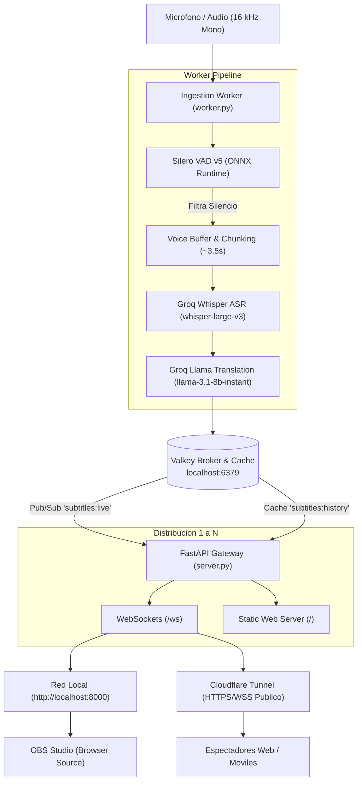

# Live Subtitles & Real-time Translation (EN &rarr; ES)

<p align="center">
  <a href="LICENSE"></a>
  
  
  
  
  
  
</p>

Sistema Open Source de subtitulado y traducción de audio en vivo de alto rendimiento (Ingles &rarr; Español) para transmisiones 1 a N. Diseñado específicamente para **creadores de contenido y streamers (OBS Studio / Twitch / YouTube)** y para **lectura continua accesible en navegadores web y móviles**.

---

## Demostracion Visual de Modos

````carousel
<!-- slide -->
### Modo Overlay para OBS Studio (`/?mode=overlay`)
Fondo 100% transparente, tipografía monocromática / monospace de contorno nítido de alto contraste legible sobre cualquier videojuego o cámara, mostrando únicamente las últimas frases con desvanecimiento automático tras 10 segundos de silencio.

```text
┌─────────────────────────────────────────────────────────────┐
│                                                             │
│                [ Camara / Gameplay del Stream ]             │
│                                                             │
│                                                             │
│       ┌───────────────────────────────────────────────┐     │
│       │     "Y asi, mis compatriotas estadounidenses" │     │
│       │     And so, my fellow Americans               │     │
│       └───────────────────────────────────────────────┘     │
│                                                             │
└─────────────────────────────────────────────────────────────┘
```

<!-- slide -->
### Modo Lector Web (`/`)
Interfaz oscura minimalista inspirada en OpenAI con historial cronológico, auto-scroll suave hacia nuevos mensajes, toggle para ocultar/mostrar texto original en inglés y controles de tamaño de texto.

```text
┌─────────────────────────────────────────────────────────────┐
│ En vivo     [Subtitulos en Vivo]   [Original: ON] [Auto-scroll: ON] │
├─────────────────────────────────────────────────────────────┤
│ 19:45:10                                              840ms │
│ No preguntes que puede hacer tu pais por ti...              │
│ Ask not what your country can do for you...                 │
├─────────────────────────────────────────────────────────────┤
│ 19:45:14                                              790ms │
│ Pregunta que puedes hacer tu por tu pais.                   │
│ Ask what you can do for your country.                       │
└─────────────────────────────────────────────────────────────┘
```
````

---

## Arquitectura del Sistema



---

## Quickstart en 3 Pasos

### 1. Clonar y Configurar Credenciales
```bash
git clone https://github.com/tu-usuario/live-subtitles-translator.git
cd live-subtitles-translator

# Copiar plantilla y configurar tu GROQ_API_KEY gratuita
cp .env.example .env
nano .env  # o abre con tu editor preferido
```
*(Obtén tu API Key gratuita en [Groq Console](https://console.groq.com/keys)).*

### 2. Iniciar Infraestructura y Gateway
Tienes dos alternativas para levantar el backend:

#### Opción A: Con Docker Compose (Recomendado)
```bash
docker compose up -d
```
El gateway estará listo en `http://localhost:8000`.

#### Opción B: Inicio Nativo con Túnel Público Cloudflare
```bash
./start.sh
```
El script levantará Valkey, FastAPI y un túnel efímero con URL pública `https://*.trycloudflare.com` lista para compartir.

### 3. Iniciar la Captura de Audio (Worker)
En tu terminal:
```bash
# Iniciar con tu micrófono por defecto (EN -> ES):
./venv/bin/python worker.py

# Transcripción Nativa Directa en Español (ES -> ES, con Bypass de traducción):
./venv/bin/python worker.py --source-lang es --target-lang es

# Traducir de Inglés a Portugués (EN -> PT):
./venv/bin/python worker.py --source-lang en --target-lang pt

# Listar dispositivos para elegir tu micrófono:
./venv/bin/python worker.py --list-devices
./venv/bin/python worker.py --device 0

# O probar con archivo WAV pregrabado:
./venv/bin/python worker.py --file sample_jfk.wav
```

---

## Matriz Multilingüe Dinámica (Sprint 1)

El sistema admite cualquier combinación entre **Inglés (EN)**, **Español (ES)** y **Portugués (PT)**:

| Combinación | Modo de Procesamiento | Latencia Promedio | Consumo de Tokens |
| :--- | :--- | :--- | :--- |
| **EN &rarr; ES** | Whisper ASR + LLaMA Translation | ~1.0s – 1.1s | Normal (ASR + LLM) |
| **ES &rarr; ES** | **Bypass Automático** (Transcripción Nativa) | **~400ms – 500ms** | **Cero tokens de LLM** |
| **ES &rarr; EN** | Whisper ASR + LLaMA Translation | ~1.0s – 1.1s | Normal (ASR + LLM) |
| **EN &rarr; PT** | Whisper ASR + LLaMA Translation | ~1.0s – 1.1s | Normal (ASR + LLM) |
| **ES &rarr; PT** | Whisper ASR + LLaMA Translation | ~1.0s – 1.1s | Normal (ASR + LLM) |

> [!TIP]
> Cuando el idioma de origen y destino son idénticos (ej. `ES -> ES`), el worker **omite por completo la llamada al modelo de chat**, entregando la transcripción de Whisper directamente a los clientes en tiempo récord (~400 ms).

---

## Glosario y Sesgo de Dominio (Domain Bias & Glossary)

El sistema integra un mecanismo de **Domain Biasing** de dos etapas que garantiza que nombres propios, siglas complejas, marcas y jerga especializada se transcriban y traduzcan con máxima precisión sin deformaciones fonéticas ni traducciones literales no deseadas.

### ¿Cómo funciona internamente?

1. **Sesgo Fonético en Whisper (ASR Biasing)**:
   - Whisper recibe los términos del glosario a través de su parámetro `prompt`.
   - Esto condiciona la matriz de probabilidades del decodificador acústico: si el audio contiene una palabra fonéticamente ambigua o con acento regional marcado, el modelo favorece los términos cargados en el glosario en lugar de confundirlos con palabras genéricas similares.
   - El worker utiliza un **pool rotativo dinámico**: mantiene los 20 términos más prioritarios fijos en cada fragmento e intercala muestras rotativas del resto para cubrir vocabularios de cientos de palabras sin exceder el límite de tokens de Whisper.

2. **Preservación Semántica en el Traductor (LLM Preservation)**:
   - El modelo de traducción (LLM) recibe directrices estrictas para preservar la terminología oficial, tecnologías, acrónimos y entidades sin traducirlas literalmente al español (ej. mantener *pipeline, backend, deploy, commit* en su forma estándar de la industria en vez de traducirlos como *tubería* o *desplegar*).

### ¿Cómo personalizar el glosario según tu transmisión?

Puedes adaptar el glosario a cualquier temática simplemente editando el archivo [`glossary.txt`](glossary.txt) o creando archivos separados para cada tipo de evento:

#### Ejemplos de uso por temática:

- **Programación & Cloud (por defecto)**:
  ```text
  Kubernetes, Docker, Postgres, AWS, Dijkstra, FastAPI, CI/CD, Pull Request, Commit, Refactor
  ```

- **Noticias, Política & Actualidad**:
  ```text
  DNU, AFIP, ARCA, INDEC, Balotaje, Casa Rosada, Plaza de Mayo, Francos, Milei, Kicillof, Caputo
  ```

- **Deportes & Fútbol**:
  ```text
  Scaloneta, Bombonera, Monumental, VAR, Offside, Hat-trick, Premier League, Libertadores, Conmebol
  ```

- **Medicina o Finanzas**:
  ```text
  Nasdaq, S&P 500, Yield, Fintech, Bullish, Bearish, Cripto, Blockchain, Resonancia, Hemoglobina
  ```

### Formas de Configuración:

1. **Vía archivo local (`glossary.txt`)**:
   Añade tus términos separados por comas o por líneas en `glossary.txt`. El worker los cargará automáticamente al arrancar.

2. **Vía variables de entorno (`.env`)**:
   ```env
   # Ruta a un archivo alternativo
   GLOSSARY_FILE=glosarios/noticias.txt

   # O inyección rápida de términos directos separados por comas:
   GLOSSARY_TERMS=Valkey,Kubernetes,OpenAI,DeepMind
   ```

3. **Vía línea de comandos (CLI)**:
   ```bash
   ./venv/bin/python worker.py --glossary glosarios/deportes.txt --stream-url "https://..."
   ```

---

## Optimización para Quemar Subtítulos en OBS (Burn-in Overlay)

Para incrustar los subtítulos directamente sobre el video saliente de Twitch/YouTube sin degradación de rendimiento:

1. En **OBS Studio**, añade una fuente de tipo **Navegador** (*Browser*).
2. Configura los parámetros:
   - **URL:** `http://localhost:8000/?mode=overlay` (o añade el par deseado: `?mode=overlay&pair=es-es`)
   - **Ancho (*Width*):** `1920` (o el ancho de tu lienzo)
   - **Alto (*Height*):** `1080` (o el alto de tu lienzo)
   - **FPS:** `30` o `60` (el renderizado CSS está optimizado por GPU con `will-change` y `contain: layout paint`).
   - **CSS personalizado:** Vacío.
   - Marca: **Actualizar el navegador cuando la escena se active**.
3. **Legibilidad Burn-in:** El overlay aplica tipografía monocromática / monospace con trazo perimetral (`-webkit-text-stroke: 1.2px #000`) y sombra multi-nivel de 360° que garantiza lectura perfecta sobre fondos totalmente blancos, oscuros o con mucho movimiento. Muestra un máximo estricto de 2 a 3 líneas y desvanece las frases anteriores tras 10 segundos de silencio.

---

## Persistencia, Exportación y Dashboard Audiovisual (Sprint 2)

El sistema incluye capacidades profesionales para eventos audiovisuales y conferencias multiescenario:

### 1. Exportación Completa de Transcripciones (SRT, VTT, TXT)
Cada frase procesada almacena sus marcas de tiempo relativas precisas (`start_time` y `end_time` en segundos con milisegundos) en una base de datos local SQLite configurada en modo WAL (`database.py`):

- **SubRip (.srt):** Formateado con bloques estándar `00:00:01,250 --> 00:00:04,500` bilingüe o idioma único.
- **WebVTT (.vtt):** Cabecera `WEBVTT` para reproductores HTML5 y plataformas de video.
- **Texto Plano (.txt):** Con marcas de tiempo simples `[00:00:01] Frase`.

#### Endpoints REST de Exportación:
```bash
# Descargar subtítulos en formato SRT (bilingüe por defecto):
curl "http://localhost:8000/api/sessions/main/export?format=srt" -o subtitles_main.srt

# Descargar en formato WebVTT sólo el idioma traducido:
curl "http://localhost:8000/api/sessions/stage-1/export?format=vtt&bilingual=false" -o stage1.vtt

# Descargar en texto plano para actas o resúmenes:
curl "http://localhost:8000/api/sessions/main/export?format=txt" -o session.txt

# Cerrar formalmente una sesión:
curl -X POST "http://localhost:8000/api/sessions/stage-1/close"
```

---

### 2. Arquitectura Multisesión Concurrente (Salas en Paralelo)
El sistema soporta transmisiones simultáneas en múltiples salas (ej. `stage-1`, `track-ai`, `main`):
- **Canales Valkey Aislados:** Cada sala publica en `subtitles:{session_id}:live` y guarda su historial en `subtitles:{session_id}:history`.
- **WebSockets Segmentados:** Los clientes conectados a `/ws/stage-1` o `/?session=stage-1` reciben exclusivamente los subtítulos de esa sala.
- **Rotación Multi-API Key de Groq:** Puedes especificar múltiples claves en `.env` (`GROQ_API_KEYS=key1,key2,key3`). El sistema rota automáticamente entre ellas y aplica un cooldown de 60 segundos si alguna alcanza el rate limit (HTTP 429).
- **Iniciar un worker en una sala específica:**
  ```bash
  ./venv/bin/python worker.py --session-id stage-1 --source-lang en --target-lang es
  ```
- **Simular 5 salas concurrentes para pruebas de carga:**
  ```bash
  ./venv/bin/python simulate_sessions.py --rooms stage-1 stage-2 stage-3 stage-4 stage-5 --chunks 5
  ```

---

### 3. Dashboard de Control Room en Vivo (`/dashboard`)
Panel de monitoreo para operadores audiovisuales accesible en `http://localhost:8000/dashboard`:
- **Telemetría en tiempo real por SSE:** Actualizaciones continuas vía Server-Sent Events (`/api/telemetry/stream`) sin frameworks pesados.
- **Tarjetas por Sala:** Estado en vivo (`En Vivo`, `Silencio`, `Inactivo`), espectadores conectados, desglose de latencia (ASR ms, Traducción ms, Total ms) y Groq RPM.
- **Alerta de Silencio Audiovisual:** Si una sala en vivo no detecta voz durante más de **15 segundos**, la tarjeta avisa al operador técnico de una posible caída de audio o micrófono muteado.
- **Acciones Rápidas:** Descarga de SRT/VTT con 1 clic, copia instantánea de la URL para OBS (`/overlay?session=...`) y botón de finalización de sesión.

---

## Estrategia de Audio: Nativo o Docker

| Modo | Compatibilidad | Recomendación |
| :--- | :--- | :--- |
| **Worker Nativo (`worker.py`)** | **Universal:** Linux, macOS, Windows | **Recomendado:** Accede directamente a la tarjeta de sonido y micrófonos USB/Bluetooth sin latencia adicional ni permisos complejos. |
| **Worker en Docker (`--profile with-worker`)** | **Linux únicamente** | Adecuado para servidores headless o máquinas Linux dedicadas pasando `--device /dev/snd:/dev/snd`. |

---

## Análisis de Costos y Viabilidad

| Nivel | Costo Estimado | Descripción |
| :--- | :--- | :--- |
| **Tier Gratuito (Groq Cloud)** | **$0.00 USD** | Silero VAD filtra silencios manteniendo el flujo en ~10-15 RPM. Entra 100% dentro de la cuota gratuita de Groq. |
| **Producción Pay-as-you-go** | **~$0.11 USD / hora** | Precios de Groq Cloud: Whisper Large v3 ($0.111 / hora de audio) + Llama 3.1 8B ($0.05 / 1M tokens). **80 horas de streaming continuo cuestan menos de $10 USD.** |

---

## Publicación y Release Open Source

Para etiquetar y publicar el release `v1.0.0` en Git:

```bash
git add .
git commit -m "feat: initial open source release v1.0.0"
git tag -a v1.0.0 -m "Release v1.0.0: Live Subtitles & Translation System"
git push origin main --tags
```

---

## Licencia

Este proyecto está distribuido bajo la licencia **MIT**. Consulta el archivo [`LICENSE`](LICENSE) para más detalles.
