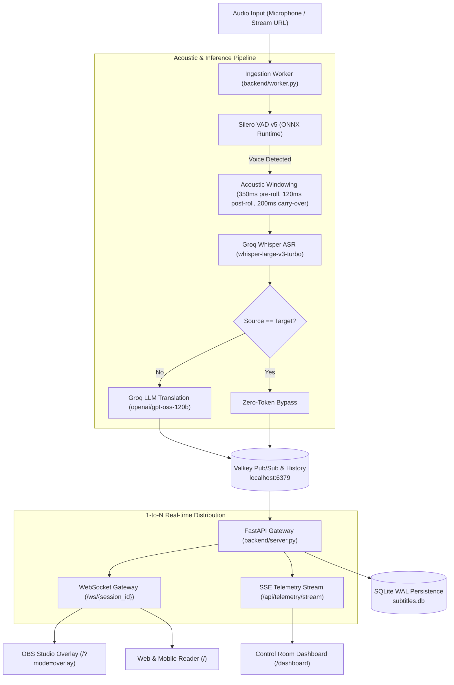

# LiveSubs

High-performance real-time speech recognition, translation, and live subtitling engine designed for live streams (OBS Studio, Twitch, YouTube) and accessible web/mobile clients.

[](LICENSE)
[](https://python.org)
[](https://fastapi.tiangolo.com)
[](https://valkey.io)
[](https://groq.com)
[](Dockerfile)

---

## Architecture



---

## Quickstart

### Prerequisites

- Python 3.10+
- Valkey or Redis (`docker run -d --name valkey -p 6379:6379 valkey/valkey:7.2-alpine`)
- FFmpeg (for livestream and media ingestion)
- A free [Groq Cloud API Key](https://console.groq.com/keys)

### 1. Installation

```bash
git clone https://github.com/elias7896/livesubs.git
cd livesubs

python -m venv venv
source venv/bin/activate
pip install -r requirements.txt

cp .env.example .env
# Edit .env and set your GROQ_API_KEY
```

### 2. Start Services

#### Automated (Server + Valkey + Cloudflare Tunnel)
```bash
./scripts/start.sh
```

#### Manual / Development
```bash
# Start Valkey in Docker
docker run -d --name valkey -p 6379:6379 valkey/valkey:7.2-alpine

# Start FastAPI Gateway
python backend/server.py
```
The server will bind to `http://localhost:8000`.

### 3. Start Audio Ingestion Worker

In a separate terminal:

```bash
# Microphone capture (English -> Spanish):
./venv/bin/python backend/worker.py --source-lang en --target-lang es

# Native transcription without translation (Spanish -> Spanish, 0 LLM tokens):
./venv/bin/python backend/worker.py --source-lang es --target-lang es

# Live stream capture (YouTube, Twitch, Kick, HLS/m3u8):
./venv/bin/python backend/worker.py --stream-url "https://www.youtube.com/watch?v=..." --source-lang es --target-lang en

# Pre-recorded audio file:
./venv/bin/python backend/worker.py --file /path/to/audio.wav --source-lang en --target-lang es
```

To stop all background services started by `start.sh`:
```bash
./scripts/stop.sh
```

---

## Client Interfaces

| Interface | URL | Description |
| :--- | :--- | :--- |
| **OBS Overlay** | `http://localhost:8000/?mode=overlay` | Transparent, high-contrast monospace overlay designed for OBS Browser Sources. 1-2 line broadcast display with automatic 10-second fadeout on silence. |
| **Web Reader** | `http://localhost:8000/` | Minimalist dark reader with smooth auto-scroll, bilingual toggle, font scaling, and session selector. |
| **Control Room** | `http://localhost:8000/dashboard` | Real-time monitoring dashboard with SSE telemetry, per-session latency breakdown (ASR, Translation, Total), silence alerts (>15s), and 1-click SRT/VTT exports. |

### OBS Studio Setup

1. Add a **Browser Source** in OBS Studio.
2. Set URL to `http://localhost:8000/?mode=overlay` (or append `&session=<room>&pair=es-en`).
3. Set Canvas Resolution (e.g. `1920x1080`).
4. Enable **Shutdown source when not visible** and **Refresh browser when scene becomes active**.

---

## Core Capabilities

### 1. Multilingual Translation Matrix

| Pair | Processing Mode | Average Latency | Token Overhead |
| :--- | :--- | :--- | :--- |
| **EN -> ES** | Whisper ASR + LLM MT | ~1.0s – 1.6s | ASR + LLM tokens |
| **ES -> ES** | Native Transcription (Bypass) | ~350ms – 500ms | 0 LLM tokens |
| **ES -> EN** | Whisper ASR + LLM MT | ~1.0s – 1.6s | ASR + LLM tokens |
| **EN -> PT** | Whisper ASR + LLM MT | ~1.0s – 1.6s | ASR + LLM tokens |
| **ES -> PT** | Whisper ASR + LLM MT | ~1.0s – 1.6s | ASR + LLM tokens |

When source and target languages match, the LLM stage is completely bypassed, delivering raw ASR text immediately.

### 2. Acoustic Windowing & Truncation Protection

- **350ms Acoustic Pre-roll**: Captures word-initial plosives and fricatives before VAD activation.
- **120ms Post-roll**: Preserves trailing syllables and word endings during silence decay.
- **200ms Overlap Carry-over**: On forced chunk boundaries, the last 200ms are carried into the subsequent window to avoid splitting cross-boundary words.
- **Dynamic Cadence**: Chunks target 4.0s with an elastic maximum ceiling of 5.5s, maintaining a steady 3.5s–4.5s subtitle update cadence.

### 3. Domain Biasing (Technical Glossary)

A two-stage biasing mechanism guarantees technical terms, acronyms, and names are correctly recognized and preserved:
1. **Whisper ASR Conditioning**: High-priority terms are injected into the Whisper prompt to bias acoustic decoding probabilities.
2. **LLM Translation Guardrails**: System prompts enforce retaining technical industry standards (`pipeline`, `backend`, `deploy`, `commit`) rather than literal translations.

Specify terms via [`glossary.txt`](glossary.txt), the `GLOSSARY_TERMS` environment variable, or the `--glossary` CLI flag.

### 4. Persistence & Export API

Every processed sentence is stored in SQLite (WAL mode) with relative millisecond-precision timestamps (`start_time`, `end_time`).

```bash
# Export SubRip (.srt)
curl "http://localhost:8000/api/sessions/{session_id}/export?format=srt" -o subtitles.srt

# Export WebVTT (.vtt)
curl "http://localhost:8000/api/sessions/{session_id}/export?format=vtt" -o subtitles.vtt

# Export Plain Text (.txt)
curl "http://localhost:8000/api/sessions/{session_id}/export?format=txt" -o subtitles.txt
```

### 5. API Key Management & Rate Limit Balancing

- **Single Key (`GROQ_API_KEY`)**: Standard mode. When using Groq Cloud's paid Pay-as-you-go tier, rate limits are high (thousands of RPM/TPM), making a single key sufficient for continuous 24/7 multi-room broadcasting without requiring rotation.
- **Key Rotation (`GROQ_API_KEYS`)**: Multiple comma-separated keys (`GROQ_API_KEYS=key1,key2,key3`). Primarily designed for the **Free Tier**. If any key encounters HTTP 429 (Rate Limit Exceeded), the worker automatically assigns a 2.5-second cooldown and immediately switches to the next available key in round-robin, preventing live subtitle stalls.

---

## Worker CLI Reference

```
usage: worker.py [-h] [--session-id SESSION_ID] [--source-lang SOURCE_LANG]
                 [--target-lang TARGET_LANG] [--glossary GLOSSARY]
                 [--device DEVICE] [--list-devices] [--file FILE]
                 [--stream-url STREAM_URL] [--is-live]

options:
  --session-id SESSION_ID    Session / Room identifier (default: default)
  --source-lang SOURCE_LANG  Source language code (en, es, pt, auto)
  --target-lang TARGET_LANG  Target language code (es, en, pt)
  --glossary GLOSSARY        Path to custom glossary file
  --device DEVICE            Audio input device index
  --list-devices             List available audio devices and exit
  --file FILE                Path to WAV file for offline / batch ingestion
  --stream-url STREAM_URL    Live stream URL (YouTube, Twitch, Kick, RTMP, HLS)
  --is-live                  Force livestream mode (tune directly to live edge)
```

---

## Docker Deployment

To run the complete gateway with Valkey in Docker:

```bash
docker compose up -d
```

To run with the optional audio capture worker (Linux only, requires host audio device):
```bash
docker compose --profile with-worker up -d
```

---

## Testing & Concurrent Simulation

Simulate multiple parallel stages (e.g. 5 concurrent tracks) to stress-test Valkey routing, SQLite WAL concurrency, and dashboard telemetry:

```bash
./venv/bin/python scripts/simulate_sessions.py --rooms stage-1 stage-2 stage-3 stage-4 stage-5 --chunks 10 --delay 2.5
```

---

## Production Architecture & High-Traffic Scaling

### Traffic & Resource Footprint

- **Decoupled 1-to-N Pipeline**: Ingestion inference (ASR + LLM) occurs exactly once per audio chunk (~4s) regardless of viewer count. 1 viewer or 50,000 viewers incur the identical AI inference overhead.
- **Bandwidth Profile**: Subtitle JSON payloads average ~250 bytes per 4 seconds (~60 B/s per client, or ~0.5 kbps). 1,000 concurrent viewers consume less than 0.6 Mbps of outbound network traffic.

### Deployment Recommendations

| Target Concurrency | Recommended Infrastructure | Configuration |
| :--- | :--- | :--- |
| **Up to 5,000 – 10,000 Viewers** | **Single Linux VM** (4 vCPUs, 8 GB RAM, e.g. Azure D4as_v5, AWS c6i.xlarge, or Hetzner CX31) | Run Valkey via Docker, tune OS open file descriptors (`ulimit -n 65535`), and run Uvicorn directly with standard WebSocket loop. Viable and cost-effective (< $40/mo). |
| **10,000 to 100,000+ Viewers** | **Distributed Container Cluster** (Kubernetes AKS/EKS, AWS ECS, or Docker Swarm) | **Ingestion**: 1 worker per active stream channel.<br>**Broker**: Managed Valkey/Redis instance (e.g., Azure Cache for Redis, AWS ElastiCache).<br>**WebSockets**: Horizontally scale stateless `backend.server:app` replicas behind a Layer 7 Load Balancer (Nginx / AWS ALB / Traefik) handling TLS termination. |

---

## License

MIT. See [LICENSE](LICENSE) for details.
