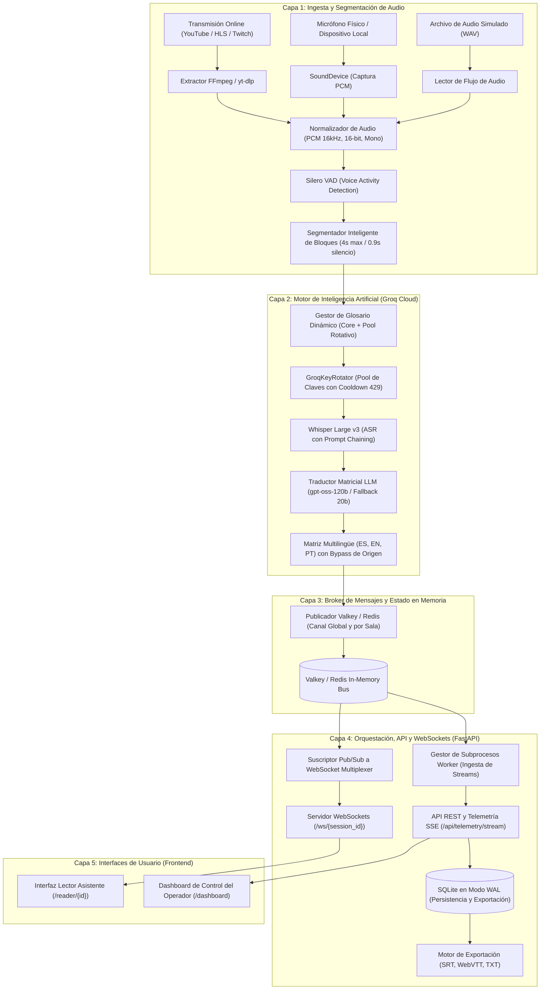
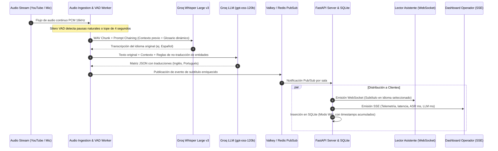
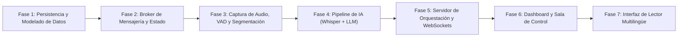

# Guía Maestra de Arquitectura & Plan de Implementación por Fases

## Sistema de Subtitulado en Vivo y Traducción Simultánea Multilingüe para Conferencias Tech

---

## 1. Visión General del Sistema

El sistema es una plataforma de alta concurrencia diseñada para la ingesta de audio en tiempo real, transcripción fonética precisa (ASR), traducción matricial simultánea mediante Modelos de Lenguaje de Gran Escala (LLM) y distribución de subtítulos con latencia sub-segundo hacia salas de conferencia y asistentes remotos.

El proyecto permite gestionar múltiples transmisiones concurrentes (salas o escenarios independientes como Auditorio Principal, Sala Taller, etc.), ingiriendo audio desde transmisiones en vivo (YouTube, Twitch, Kick, HLS), micrófonos locales o archivos de prueba.

### Capacidades Principales
- **Ingesta Multicanal Concurrente:** Procesamiento simultáneo de múltiples flujos de audio independientes sin degradación cruzada.
- **Segmentación Inteligente por Voz (VAD):** Detección de actividad vocal mediante Silero VAD para fragmentar el habla de forma natural en oraciones completas (pausas de 0.9s o ventanas de 4.0s) en lugar de cortes fijos arbitrarios.
- **Transcripción con Sesgo de Dominio (Domain Biasing):** Inyección dinámica de glosarios técnicos (DevOps, Cloud, IA, Ciberseguridad, bases de datos y nombres de figuras del sector) en Whisper para evitar errores de grafía fonética.
- **Traducción Matricial Simultánea:** Generación paralela de traducciones a tres idiomas de referencia (Español, Inglés y Portugués) en una única pasada de inferencia, aplicando bypass de latencia cero para el idioma de origen.
- **Distribución en Tiempo Real:** Servidor de mensajería Pub/Sub de ultrabaja latencia (Valkey / Redis) acoplado a WebSockets para emisión a miles de lectores simultáneos.
- **Consola de Operador (Dashboard):** Centro de control para monitoreo de métricas (latencia extremo a extremo, tiempos de ASR/LLM, peticiones por minuto, visor de salas y gestión de transmisiones).
- **Interfaz de Lector Asistente:** Vista minimalista y optimizada para móviles y proyectores, con selector dinámico de idioma destino y reconexión automática resiliente.
- **Persistencia y Exportación:** Base de datos relacional con histórico continuo y generador de subtítulos en formatos estándar (SRT, WebVTT, TXT).

---

## 2. Diagrama de Arquitectura Global

---

## 3. Flujo de Datos Extremo a Extremo

---

## 4. Pila Tecnológica y Responsabilidades

| Componente | Tecnología | Responsabilidad Principal |
| :--- | :--- | :--- |
| **Ingesta de Streams** | `yt-dlp` + `ffmpeg` | Extracción y demuxing de audio desde URLs remotas en vivo o VOD hacia tuberías estándar (stdout). |
| **Normalización de Audio** | `numpy` + `wave` | Conversión a formato unificado (PCM mono, 16.000 Hz, 16 bits little-endian / float32). |
| **Detección de Voz (VAD)** | Silero VAD (ONNX Runtime) | Análisis de probabilidad vocal por ventana de 512 muestras para segmentación por pausas naturales. |
| **Motor ASR** | Groq Whisper Large v3 | Reconocimiento automático del habla a partir de chunks de audio con sesgo de glosario dinámico. |
| **Motor de Traducción (MT)**| Groq `openai/gpt-oss-120b` | Traducción contextual simultánea matricial (`es`, `en`, `pt`) con tolerancia fonética y preservación de marcas/tecnicismos. |
| **Broker de Mensajería** | Valkey / Redis | Distribución Pub/Sub desacoplada entre procesos workers y el servidor de clientes. |
| **Backend & WebSockets** | FastAPI + Uvicorn | Orquestación de workers, API REST de sesiones, multiplexor de WebSockets por sala y telemetría SSE. |
| **Base de Datos & Exportación**| SQLite 3 (Modo WAL) | Persistencia ACID de sesiones y subtítulos, con cálculo de timecodes para exportaciones SRT/VTT. |
| **Consola de Operador** | HTML5, Vanilla JS, CSS3 | Panel de mando y observabilidad en tiempo real sin dependencias pesadas de frameworks. |
| **Interfaz de Lector** | HTML5, WebSocket API, CSS3 | Visor minimalista con selector de idioma en cliente, escalado tipográfico y reconexión automática. |

---

## 5. Hoja de Ruta de Implementación por Fases

Para construir el sistema de forma iterativa y sin desbordar el contexto de la inteligencia artificial, el desarrollo está estructurado en 7 fases secuenciales y autosuficientes:

### Índice de Fases:
1. **[Fase 1: Persistencia y Modelado de Datos](fase-01-persistencia-y-modelado-de-datos.md)**
   - Esquema relacional de base de datos, modo WAL, transacciones seguras y generador de formatos de exportación (SRT, WebVTT, TXT).
2. **[Fase 2: Broker de Mensajería y Estado en Memoria](fase-02-broker-mensajeria-y-estado-en-memoria.md)**
   - Topología Pub/Sub en Valkey/Redis, contratos JSON de eventos, cálculo de métricas en ventana deslizante y conteo de clientes.
3. **[Fase 3: Captura de Audio, VAD y Segmentación Inteligente](fase-03-captura-audio-vad-y-segmentacion.md)**
   - Normalización de audio, ingesta desde streams y micrófonos, modelo ONNX Silero VAD y máquina de estados para segmentación natural.
4. **[Fase 4: Pipeline de Inteligencia Artificial (ASR y Traducción LLM)](fase-04-pipeline-ia-asr-whisper-y-traduccion-llm.md)**
   - Rotador de claves Groq con failover para error 429, biasing de glosario dinámico dentro del límite de 896 caracteres de Whisper y traducción matricial con LLM de alta capacidad.
5. **[Fase 5: Servidor de Orquestación, API REST y Transmisión en Tiempo Real](fase-05-servidor-orquestacion-y-transmision-tiempo-real.md)**
   - Servidor FastAPI, administrador de subprocesos worker, pasarela WebSocket multisesión, canal SSE de telemetría y endpoints REST.
6. **[Fase 6: Interfaz del Operador (Dashboard y Sala de Control)](fase-06-interfaz-operador-dashboard-y-sala-de-control.md)**
   - Panel de control de la sala de transmisión, tarjetas de métricas, modal para agregar transmisiones con selección explícita de idioma origen, y acciones en vivo.
7. **[Fase 7: Interfaz del Asistente (Modo Lector Multilingüe)](fase-07-interfaz-asistente-modo-lector-multilingue.md)**
   - Interfaz de lectura para asistentes, cambio de idioma destino instantáneo en cliente, control de tipografía, contraste y reconexión resiliente.

---

## 6. Instrucciones para la IA que Ejecuta las Fases

Cuando se solicite implementar una fase específica:
1. **Leer íntegramente el archivo correspondiente a dicha fase.**
2. **No saltear componentes ni mezclar responsabilidades de fases posteriores.**
3. **Asegurar que cada componente implementado cumpla estrictamente con los contratos de datos, nombres de campos y especificaciones de la fase.**
4. **Ejecutar las validaciones de criterios de aceptación detalladas al final del archivo antes de dar la fase por completada.**
