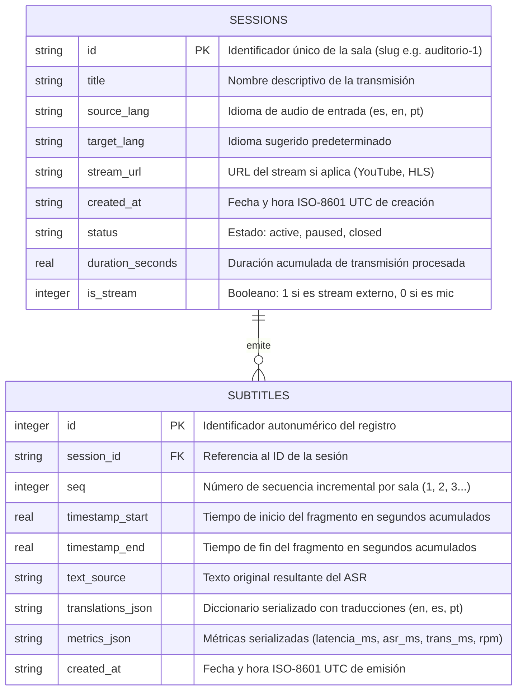
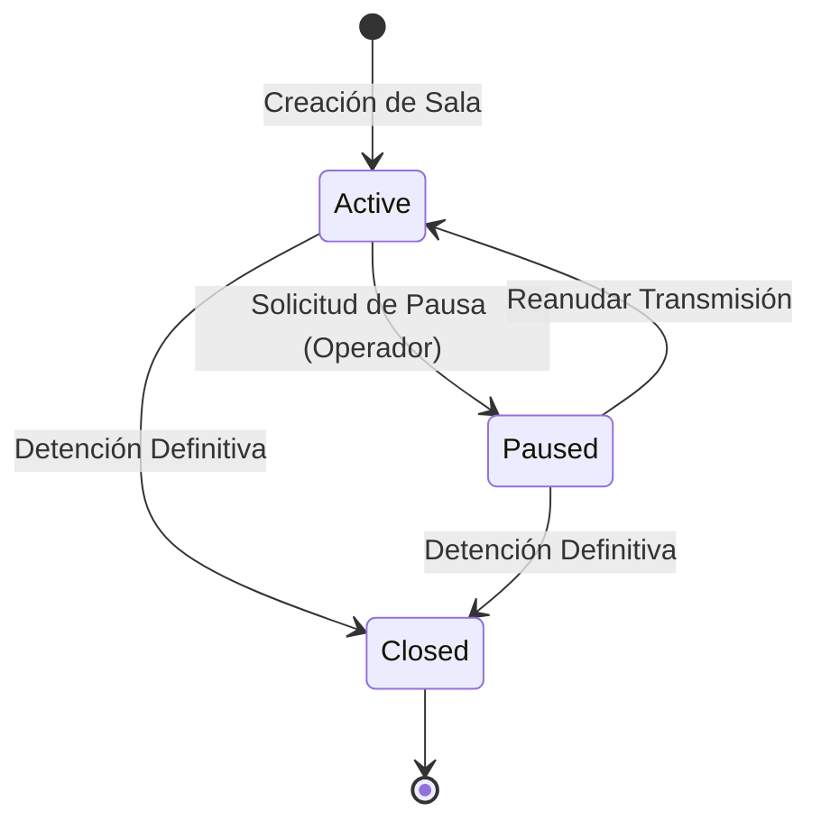
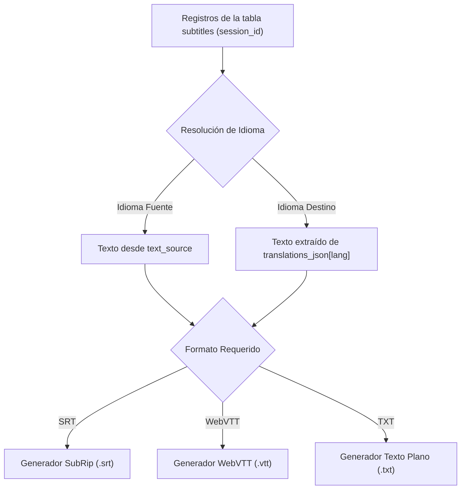

# Fase 1: Persistencia y Modelado de Datos

---

## 1. Objetivo de la Fase
Establecer la capa fundamental de almacenamiento relacional para el sistema de subtitulado. Esta fase es responsable de persistir las salas/sesiones activas, registrar de forma acumulativa y transaccional cada fragmento de subtítulo emitido con sus métricas asociadas, y proporcionar un motor de transformación hacia formatos estándar de exportación de subtítulos (SRT, WebVTT y Texto Plano).

---

## 2. Motor de Almacenamiento y Configuración de Concurrencia

El sistema utiliza **SQLite 3** configurado para entornos concurrentes de lectura y escritura intensiva. Para garantizar alto rendimiento y evitar bloqueos en operaciones simultáneas, se deben aplicar los siguientes parámetros del motor:

- **Modo Journal Write-Ahead Logging (WAL):** Permite que los lectores no bloqueen a los escritores y que los escritores no bloqueen a los lectores.
- **Sincronización:** Nivel normal (`NORMAL`), garantizando integridad en sistemas de archivos modernos sin sobrecarga de operaciones I/O en disco por cada fragmento.
- **Tiempo de Espera por Bloqueo (Busy Timeout):** Configurado en al menos 5.000 milisegundos (5 segundos) para reintentar automáticamente cualquier contención de bloqueo antes de fallar.
- **Gestión de Conexiones Multihilo:** El pool o gestor de conexiones debe operar con conexiones por hilo o mecanismos de aislamiento que no compartan un cursor activo entre distintos hilos del worker o del servidor web.

---

## 3. Diagrama Entidad-Relación

---

## 4. Especificación Detallada del Esquema

### 4.1. Tabla: `sessions`
Almacena el catálogo y estado operativo de cada sala o transmisión.

| Campo | Tipo | Nulable | Valor por Defecto | Descripción |
| :--- | :--- | :--- | :--- | :--- |
| `id` | Cadena (TEXT) | NO | Ninguno (PK) | Clave primaria. Slug identificador único de la sala (solo alfanumérico y guiones). |
| `title` | Cadena (TEXT) | SÍ | `NULL` | Título legible para operadores y asistentes (ej. "Auditorio Principal"). |
| `source_lang` | Cadena (TEXT) | SÍ | `'es'` | Código ISO 639-1 del idioma de audio original de la sala (`es`, `en`, `pt`). |
| `target_lang` | Cadena (TEXT) | SÍ | `'en'` | Código ISO del idioma sugerido por defecto. |
| `stream_url` | Cadena (TEXT) | SÍ | `NULL` | URL pública de la transmisión en vivo o video bajo demanda. |
| `created_at` | Cadena (TEXT) | NO | Fecha actual UTC | Marca temporal ISO-8601 del momento en que se creó la sesión. |
| `status` | Cadena (TEXT) | NO | `'active'` | Máquina de estados: `'active'`, `'paused'`, `'closed'`. |
| `duration_seconds` | Flotante (REAL) | NO | `0.0` | Total de segundos de audio efectivamente transcritos en la sesión. |
| `is_stream` | Entero (INTEGER) | NO | `0` | Indicador booleano (1 si la fuente es un stream online; 0 si es entrada local). |

### 4.2. Tabla: `subtitles`
Registro inmutable e incremental de cada subtítulo emitido en tiempo real.

| Campo | Tipo | Nulable | Valor por Defecto | Descripción |
| :--- | :--- | :--- | :--- | :--- |
| `id` | Entero (INTEGER) | NO | Autoincremental | Clave primaria única global. |
| `session_id` | Cadena (TEXT) | NO | Ninguno (FK) | Identificador foráneo que vincula el subtítulo con una sala de `sessions`. |
| `seq` | Entero (INTEGER) | NO | Ninguno | Secuencia numérica incremental comenzando en 1 por cada sala. |
| `timestamp_start` | Flotante (REAL) | NO | `0.0` | Marca de tiempo relativa acumulativa en segundos donde inicia el fragmento de voz. |
| `timestamp_end` | Flotante (REAL) | NO | `0.0` | Marca de tiempo relativa acumulativa en segundos donde finaliza el fragmento de voz. |
| `text_source` | Cadena (TEXT) | NO | Ninguno | Texto transcrito en el idioma original por el motor ASR. |
| `translations_json` | Cadena (TEXT) | NO | `'{}'` | Estructura JSON serializada que contiene las traducciones asociadas (ej. `{"en": "...", "pt": "..."}`). |
| `metrics_json` | Cadena (TEXT) | NO | `'{}'` | Estructura JSON con telemetría del chunk (`latency_ms`, `asr_ms`, `trans_ms`, `rpm`). |
| `created_at` | Cadena (TEXT) | NO | Fecha actual UTC | Marca temporal ISO-8601 de persistencia en base de datos. |

### 4.3. Índices de Rendimiento
Para acelerar las consultas en tiempo real y la generación de reportes:
1. **Índice Compuesto de Secuencia:** `subtitles (session_id, seq ASC)` para lecturas históricas ordenadas e inserción del próximo número correlativo.
2. **Índice Cronológico:** `subtitles (session_id, created_at ASC)` para ordenamiento por tiempo de llegada.
3. **Índice de Estado de Sesiones:** `sessions (status)` para filtrar rápidamente transmisiones activas en el dashboard.

---

## 5. Máquina de Estados de una Sesión

### Reglas de Transición:
- **`active`:** El worker asignado ingiere audio y persiste subtítulos con incremento de secuencia.
- **`paused`:** El worker suspende la inferencia hacia la sala. Si la fuente es un stream en vivo, al reanudar se debe sincronizar al borde en vivo (*live-edge*) sin perder la correlación del contador de secuencia previo.
- **`closed`:** La transmisión ha finalizado. No se permiten nuevas inserciones de subtítulos, pero los registros históricos quedan disponibles para lectura y exportación.

---

## 6. Motor de Exportación y Transformación de Subtítulos

La capa de datos debe implementar la lógica de extracción y formateo a los tres estándares de la industria según el idioma solicitado (`es`, `en`, `pt` o idioma fuente original):

### 6.1. Especificación del Formato SubRip (`.srt`)
- **Numeración de Bloque:** Secuencial incremental iniciando en 1.
- **Formato de Timecode:** `HH:MM:SS,mmm --> HH:MM:SS,mmm` (separador de milisegundos obligatorio: **coma `,`**).
- **Estructura de Bloque:**
  - Línea 1: Número de secuencia.
  - Línea 2: Timecode de inicio y fin.
  - Línea 3: Texto en el idioma seleccionado.
  - Línea 4: Línea en blanco de separación.

### 6.2. Especificación del Formato WebVTT (`.vtt`)
- **Cabecera Obligatoria:** Primera línea del archivo debe ser `WEBVTT` seguida de dos saltos de línea.
- **Formato de Timecode:** `HH:MM:SS.mmm --> HH:MM:SS.mmm` (separador de milisegundos obligatorio: **punto `.`**).
- **Estructura de Bloque:** Igual a SRT pero con identificador opcional y puntos decimales en milisegundos.

### 6.3. Fórmula de Conversión de Segundos a Timecode
Para transformar los segundos flotantes (`timestamp_start` y `timestamp_end`):
1. Calcular horas enteras: división entera de segundos entre 3.600.
2. Calcular minutos enteros: residuo entre 3.600 dividido entre 60.
3. Calcular segundos enteros: residuo entre 60.
4. Calcular milisegundos enteros: parte decimal de los segundos multiplicada por 1.000 redondeada.
5. Formatear con ceros a la izquierda: 2 dígitos para horas, 2 para minutos, 2 para segundos y 3 para milisegundos (`00:00:00,000` o `00:00:00.000`).

---

## 7. Contratos de Concurrencia y Recuperación de Estado

Para permitir pausas, caídas y reinicios sin generar saltos temporales ni colisiones de secuencia:
1. **Recuperación de Estado de Reanudación (*Resume State*):**
   - Antes de iniciar la ingesta, el worker consulta a la base de datos el registro con mayor `seq` para la sala.
   - Retorna: `ultimo_seq` (entero, por defecto 0 si es nueva sala), `ultimo_timestamp_fin` (segundos acumulados previos), y `marca_tiempo_creacion`.
   - El worker utiliza estos valores para continuar la correlación numérica y temporal sin sobrescribir registros previos.
2. **Atomicidad de Inserción:**
   - La inserción de subtítulos debe ejecutarse bajo una transacción atómica que registre el subtítulo y actualice simultáneamente el campo `duration_seconds` de la sesión.

---

## 8. Criterios de Aceptación y Validación de la Fase 1

La IA que implemente esta fase debe validar los siguientes puntos antes de continuar:
- [ ] La base de datos SQLite se crea en la ruta configurada y activa correctamente el modo `PRAGMA journal_mode = WAL`.
- [ ] La creación de sesiones valida slugs alfanuméricos y establece estados válidos (`active`, `paused`, `closed`).
- [ ] La inserción de subtítulos asigna secuencias continuas y preserva fielmente los diccionarios de traducciones y métricas en formato JSON válido.
- [ ] La consulta de estado de reanudación retorna correctamente el último `seq` y `timestamp_end` de una sesión existente.
- [ ] El motor de exportación genera archivos SRT válidos con comas en los milisegundos y archivos WebVTT con cabecera `WEBVTT` y puntos en los milisegundos.
- [ ] Una sesión cerrada rechaza nuevas inserciones pero permite la lectura y exportación completa de su contenido.
