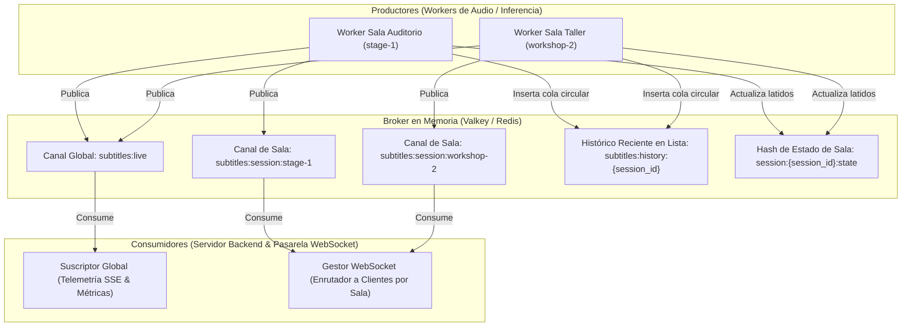
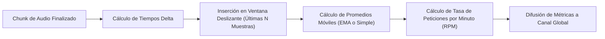
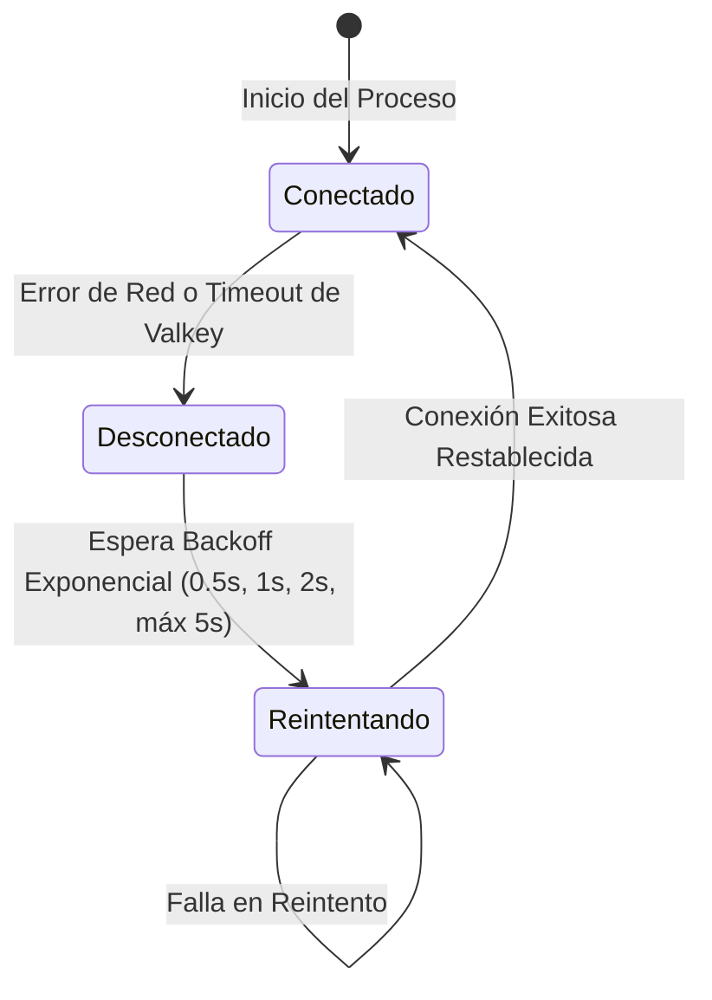

# Fase 2: Broker de Mensajería y Estado en Memoria

---

## 1. Objetivo de la Fase
Diseñar e implementar el bus de mensajería en memoria y el gestor de estado volátil utilizando **Valkey / Redis**. Este componente desacopla completamente los procesos que capturan y procesan el audio (workers) de los servicios que transmiten los datos a los clientes web (servidor FastAPI y WebSockets), garantizando una latencia de distribución inferior a 15 milisegundos y aislamiento total entre múltiples salas simultáneas.

---

## 2. Topología de Red y Arquitectura Pub/Sub

El sistema implementa una arquitectura basada en publicación y suscripción (Pub/Sub) con nombres de canal estructurados por convención para garantizar el enrutamiento selectivo de eventos:



---

## 3. Especificación de Canales y Claves en Memoria

### 3.1. Canales de Publicación / Suscripción (Pub/Sub)
| Canal | Propósito | Formato del Nombre | Audiencia / Suscriptores |
| :--- | :--- | :--- | :--- |
| **Canal de Sala Aislado** | Distribución de subtítulos específicos para los asistentes y lectores de una sala particular. | `subtitles:session:{session_id}` *(ej. `subtitles:session:auditorio`)* | Conexiones WebSocket asociadas exclusivamente a esa sala. |
| **Canal Global de Eventos** | Agregación de telemetría, métricas del sistema y control general de salas en tiempo real. | `subtitles:live` | Consola del operador (Dashboard) a través del flujo SSE de telemetría. |

### 3.2. Claves de Estado y Cache en Memoria
| Tipo de Clave | Estructura de Datos | Patrón de Clave | Tiempo de Vida (TTL) | Descripción |
| :--- | :--- | :--- | :--- | :--- |
| **Historial Reciente de Subtítulos** | Lista (`LIST`) o Conjunto Ordenado (`ZSET`) | `subtitles:history:{session_id}` | 24 Horas | Cola circular de tamaño fijo (últimos 30 subtítulos). Permite que un cliente que se conecta a mitad de la conferencia reciba contexto inmediato sin consultar el disco. |
| **Estado y Latido de Sala** | Hash (`HASH`) | `session:{session_id}:state` | 60 Segundos (renovable) | Almacena el estado en caliente (`status`, `last_activity_epoch`, `current_viewers`, `audio_minutes`). Si el worker no renueva la clave, se detecta falla de ingesta. |
| **Contador de Espectadores** | Entero (`INCR / DECR`) | `session:{session_id}:viewers` | Sin TTL manual | Cantidad instantánea de clientes conectados por WebSocket a la sala. |

---

## 4. Contratos de Datos y Esquemas JSON de Eventos

Todos los mensajes transmitidos a través del bus deben ser cadenas JSON estructuradas y estrictamente validadas.

### 4.1. Evento de Emisión de Subtítulo en Tiempo Real
Emitido por el worker cada vez que se transcribe y traduce un fragmento de habla.

```json
{
  "type": "subtitle",
  "session_id": "auditorio-principal",
  "seq": 42,
  "timestamp_start": 168.4,
  "timestamp_end": 172.1,
  "duration_seconds": 3.7,
  "text_source": "Bienvenidos a la conferencia sobre arquitectura de microservicios.",
  "source_lang": "es",
  "translations": {
    "es": "Bienvenidos a la conferencia sobre arquitectura de microservicios.",
    "en": "Welcome to the microservices architecture conference.",
    "pt": "Bem-vindos à conferência sobre arquitetura de microsserviços."
  },
  "metrics": {
    "latency_ms": 780,
    "asr_ms": 320,
    "trans_ms": 460,
    "rpm": 14.5
  },
  "created_at": "2026-09-22T15:30:00.123Z"
}
```

#### Descripción de Campos:
- `type`: Tipo de evento discriminador (`subtitle`).
- `session_id`: Slug único de la sala a la que pertenece el subtítulo.
- `seq`: Número de secuencia incremental para garantizar el orden de pintado en la interfaz.
- `timestamp_start` / `timestamp_end`: Posición de tiempo relativa en segundos de inicio y fin del fragmento.
- `text_source`: Texto crudo en el idioma detectado u original.
- `source_lang`: Código de idioma fuente de la transcripción.
- `translations`: Diccionario con la matriz de traducción simultánea completa.
- `metrics`: Medición de desempeño del fragmento:
  - `latency_ms`: Tiempo total de procesamiento desde que se cortó el chunk hasta que salió del pipeline de IA.
  - `asr_ms`: Tiempo de respuesta de la llamada ASR (Whisper).
  - `trans_ms`: Tiempo de respuesta de la traducción LLM.
  - `rpm`: Estimación de peticiones por minuto en la ventana actual.
- `created_at`: Marca temporal ISO-8601 UTC de generación del evento.

### 4.2. Evento de Cambio de Estado de Sala
Emitido cuando el operador o el orquestador altera el estado de la transmisión.

```json
{
  "type": "status_change",
  "session_id": "auditorio-principal",
  "status": "paused",
  "timestamp": "2026-09-22T15:35:10.000Z",
  "reason": "Operador pausó la transmisión"
}
```

---

## 5. Algoritmo de Cálculo de Métricas y Ventana Deslizante

Para calcular telemetría estable y representativa sin oscilaciones violentas en el dashboard:



### Reglas de Negocio para Métricas:
1. **Tamaño de la Ventana Deslizante:** Mantener en memoria una cola de las últimas 20 muestras de latencia por sala.
2. **Promedios Reportados:**
   - **Latencia Total Promedio:** Media de `(tiempo_fin_traduccion - tiempo_fin_audio)` en la ventana.
   - **Tiempo ASR Promedio:** Media de duración de la llamada a Whisper en la ventana.
   - **Tiempo MT Promedio:** Media de duración de la llamada al LLM en la ventana.
3. **Cálculo de Peticiones por Minuto (RPM):**
   - Número de fragmentos procesados exitosamente en los últimos 60 segundos transcurridos.
4. **Acumulación de Minutos de Audio:**
   - Suma acumulativa de las duraciones de los fragmentos de voz detectados dividida entre 60.

---

## 6. Estrategia de Resiliencia, Reconexión y Desconexión

El bus de mensajería debe resistir caídas temporales de red sin provocar excepciones no controladas en los hilos de audio:



### Reglas de Resiliencia:
- **Tolerancia a Desconexión en Productores:** Si el publicador pierde la conexión con Valkey, debe reintentar hasta 3 veces con un intervalo de 0.5 segundos antes de descartar el mensaje para no congelar la captura de audio en vivo.
- **Cola Circular en Cache:** Al insertar nuevos subtítulos en `subtitles:history:{session_id}`, se ejecuta un recorte (`LTRIM`) para mantener estrictamente los últimos 30 elementos, evitando crecimiento descontrolado de la memoria RAM.

---

## 7. Criterios de Aceptación y Validación de la Fase 2

La IA que implemente esta fase debe validar los siguientes puntos:
- [ ] Conexión exitosa y autenticación (si aplica) con el servicio local de Valkey o Redis en el puerto 6379.
- [ ] La publicación de un mensaje en el canal `subtitles:session:{session_id}` es recibida únicamente por los clientes suscritos a esa sala particular.
- [ ] La publicación de telemetría en `subtitles:live` es recibida de forma global por los suscriptores del panel de control.
- [ ] La cola circular de historial almacena los últimos subtítulos y descarta los más antiguos respetando el límite establecido.
- [ ] El contador de espectadores se incrementa al conectar un cliente y se decrementa atómicamente al desconectarse.
- [ ] Los eventos serializados respetan fielmente el contrato de datos JSON definido, incluyendo todos los campos de métricas y la matriz multilingüe.
