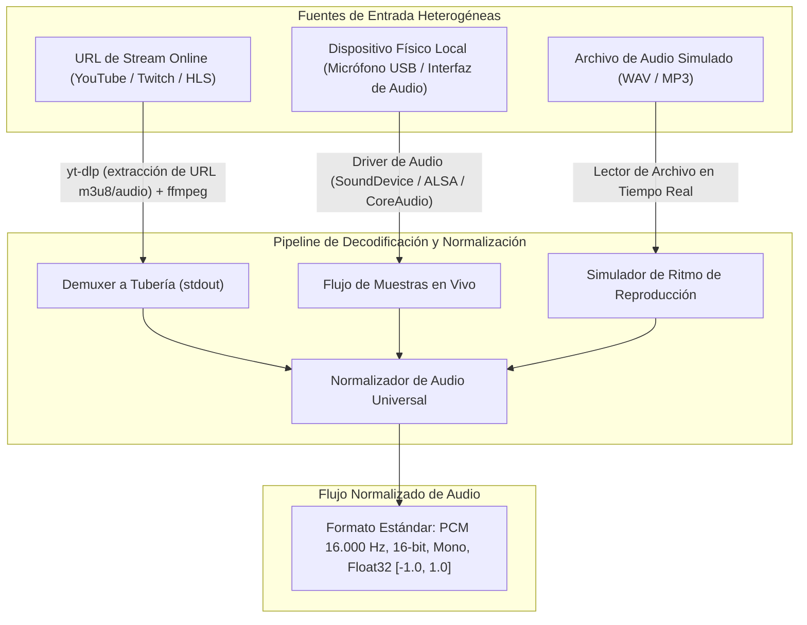
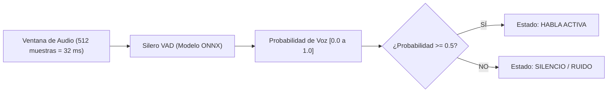
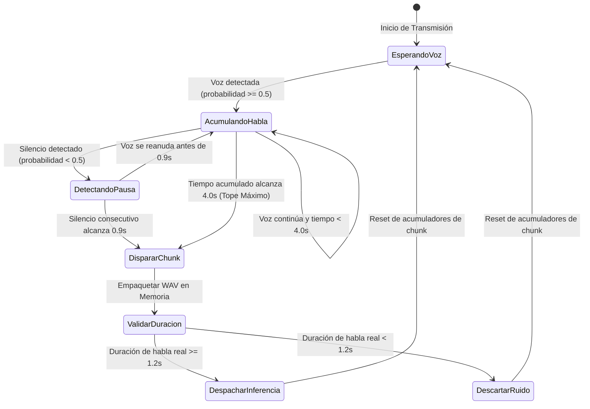
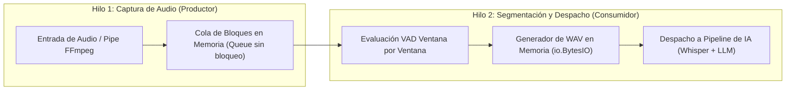

# Fase 3: Captura de Audio, VAD y Segmentación Inteligente

---

## 1. Objetivo de la Fase
Diseñar e implementar el subsistema de ingesta de audio, normalización acústica, detección de actividad vocal en tiempo real (VAD) y segmentación inteligente de fragmentos de habla. Este componente garantiza que el audio se capture de manera continua y sin pérdidas desde cualquier fuente (streams remotos de YouTube/Twitch, micrófonos físicos o archivos), y que se segmente respetando las pausas naturales de los oradores (respiraciones, finales de frase) en lugar de utilizar cortes arbitrarios por reloj que cortan palabras a la mitad.

---

## 2. Fuentes de Audio e Ingesta Normalizada

El subsistema debe aceptar tres modalidades de entrada, convirtiendo cualquier señal al formato estándar requerido por los modelos de reconocimiento del habla:



### Especificación del Formato Estándar de Audio
- **Frecuencia de Muestreo (Sample Rate):** 16.000 Hz (16 kHz).
- **Canales:** 1 (Mono). Si la fuente es estéreo o multicanal, se mezcla mediante promedio lineal a un único canal.
- **Profundidad de Bits:** 16 bits little-endian (PCM signed 16-bit) para el empaquetado final WAV.
- **Representación en Memoria para VAD:** Arreglos unidimensionales de números en coma flotante de 32 bits (`float32`) normalizados en el rango $[-1.0, 1.0]$.

---

## 3. Motor de Detección de Actividad de Voz (Silero VAD)

Para discriminar con alta precisión el habla humana frente al ruido ambiental, aplausos o música de fondo, se utiliza el modelo neuronal **Silero VAD** ejecutado sobre el motor **ONNX Runtime**.



### Parámetros de Operación del VAD:
- **Tamaño de la Ventana de Análisis:** 512 muestras a 16 kHz (exactamente **32 milisegundos** por ventana).
- **Umbral de Activación de Voz (`VAD_THRESHOLD`):** 0.50 (50% de certeza acústica).
- **Mantenimiento de Estado:** El modelo es recurrente; mantiene dos tensores de estado interno (`h` y `c`) que deben reiniciarse al arrancar una nueva transmisión o tras una pausa prolongada.

---

## 4. Máquina de Estados de la Segmentación Inteligente

El segmentador agrupa las ventanas de 32 ms en bloques de audio coherentes listos para ser enviados al motor de transcripción (ASR).



### Parámetros Temporales Clave:
| Parámetro | Valor Predeterminado | Propósito |
| :--- | :--- | :--- |
| `CHUNK_SECONDS` | **4.0 segundos** | Duración máxima permitida de un fragmento. Evita que un orador que hable sin pausas retrase indefinidamente la salida de los subtítulos. |
| `PAUSE_SILENCE_SECONDS` | **0.9 segundos** | Duración de silencio continuo que dispara el corte natural de la oración. 0.9s corresponde a una pausa respiratoria o punto y aparte típico en conferencias. |
| `MIN_SPEECH_DURATION` | **1.2 segundos** | Duración mínima requerida de habla acumulada en el fragmento. Si el orador tose, carraspea o dice un sonido breve de menos de 1.2s, el bloque se descarta para evitar llamadas vacías a la API. |

---

## 5. Sincronización Temporal: Livestream vs VOD

El comportamiento de la captura de audio varía según la naturaleza del flujo multimedia:

```mermaid
flowchart TD
    A["Nueva Solicitud de Ingesta"] --> B{"¿Es Livestream o VOD?"}
    
    B -->|Transmisión en Vivo (is_live = true)| C["Sintonización al Borde en Vivo (Live-Edge)"]
    C --> C1["No aplicar saltos temporales al pasado"]
    C1 --> C2["Si se reanuda tras pausa: descartar audio intermedio acumulado y conectar en tiempo presente"]

    B -->|Video Grabado / VOD (is_live = false)| D["Sintonización con Fast-Seek"]
    D --> D1["Consultar último timestamp_end en SQLite"]
    D1 --> D2["Iniciar ffmpeg con desplazamiento (-ss timestamp_end) para continuar exactamente donde pausó"]
```

### Acumulación de Timestamps de Sesión:
Para que los timecodes generados en los archivos exportados (SRT/VTT) sean continuos y no se reinicien en cero tras una reconexión:
1. El worker lee `ultimo_timestamp_fin` desde el estado persistido.
2. Cada chunk emitido calcula sus marcas relativas como:
   - `inicio_chunk = ultimo_timestamp_fin + tiempo_transcurrido_en_bloque`
   - `fin_chunk = inicio_chunk + duracion_chunk`
3. Se actualiza el puntero acumulativo `ultimo_timestamp_fin = fin_chunk`.

---

## 6. Arquitectura Concurrente: Productor - Consumidor

Para que el procesamiento de red e inferencia no bloquee la lectura de las tarjetas de sonido ni provoque desbordamientos de búfer (*buffer overflow*):



### Reglas de Gestión de la Cola:
- **Descarte por Saturación:** Si el hilo de inferencia sufre una degradación temporal de red y la cola acumula más de 10 segundos de audio sin procesar en una transmisión en vivo, se purgan los bloques más antiguos para sincronizarse de inmediato al presente de la sala.

---

## 7. Criterios de Aceptación y Validación de la Fase 3

La IA que implemente esta fase debe validar los siguientes puntos:
- [ ] La normalización de audio genera muestras estrictamente a 16 kHz Mono Float32.
- [ ] El modelo ONNX Silero VAD carga correctamente y evalúa paquetes de 512 muestras retornando probabilidades coherentes (cerca de 0.0 en silencio, superior a 0.7 con habla humana).
- [ ] El corte por pausa de 0.9s se dispara correctamente al cesar el habla, sin esperar al límite de 4.0s.
- [ ] Si el habla es continua, el fragmento se corta forzosamente a los 4.0s exactos.
- [ ] Fragmentos de audio con menos de 1.2s de habla efectiva son descartados silenciosamente sin generar peticiones ASR innecesarias.
- [ ] El flujo para transmisiones en vivo se engancha al borde actual del stream, descartando audio histórico acumulado durante períodos de pausa.
