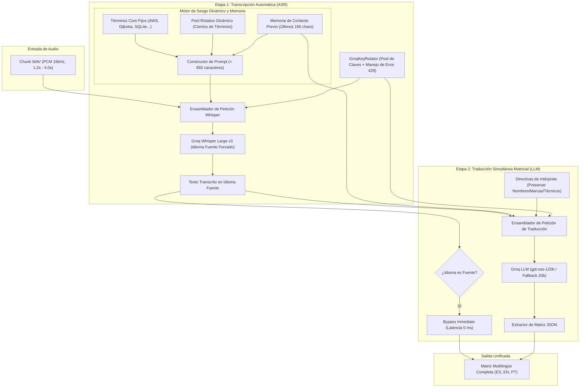
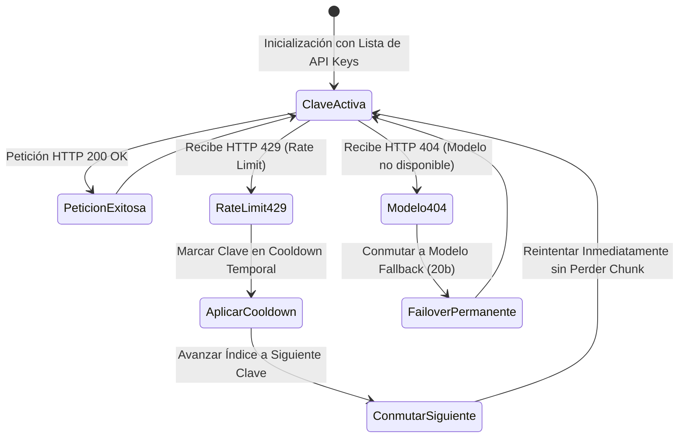
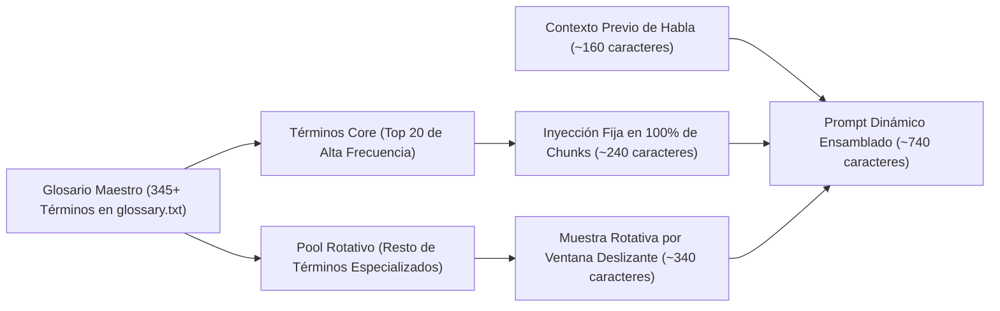
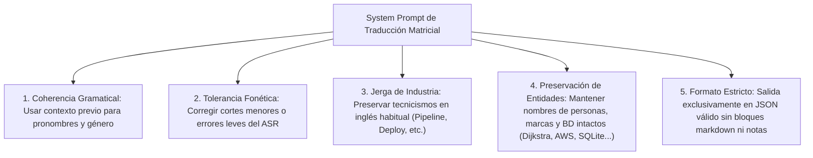

# Fase 4: Pipeline de Inteligencia Artificial (ASR y Traducción LLM)

---

## 1. Objetivo de la Fase
Diseñar e implementar el motor de inferencia de inteligencia artificial de alta velocidad y fidelidad conceptual. Este subsistema recibe los fragmentos de audio WAV generados en la Fase 3, los transcribe mediante **Groq Whisper Large v3** aplicando sesgo de vocabulario especializado (*domain biasing*) y memoria contextual (*prompt chaining*), y luego traduce simultáneamente el texto a la matriz de idiomas de la conferencia (**Español, Inglés y Portugués**) utilizando un modelo de lenguaje de gran capacidad (**`openai/gpt-oss-120b`** con respaldo en **`openai/gpt-oss-20b`**), manteniendo una latencia de inferencia agregada inferior a 1.200 milisegundos.

---

## 2. Arquitectura del Pipeline de Dos Etapas



---

## 3. Gestor de Claves de API y Resiliencia (GroqKeyRotator)

Para soportar conferencias de jornada completa con 8 o 9 transmisiones paralelas sin colapsar por límites de tasa de peticiones por minuto (RPM) o límites de tokens por minuto (TPM):



### Reglas de Rotación:
1. **Distribución Inicial Equitativa:** Al instanciar un worker de sala, el índice inicial de clave se calcula como `hash(session_id) % total_claves`, distribuyendo la carga de múltiples salas entre las distintas cuentas disponibles.
2. **Duración del Cooldown tras 429:**
   - Si existe un pool con múltiples claves: la clave agotada se suspende durante **6.0 segundos** mientras las demás absorben la carga.
   - Si solo existe 1 clave: el cooldown se fija en un valor corto (**3.0 a 5.0 segundos**) para liberar el bucket de Groq sin congelar permanentemente el flujo de audio.
3. **Failover Permanente para Modelos Inexistentes (404):** Si el modelo primario no está habilitado en la cuenta de Groq utilizada, el sistema conmuta inmediatamente y de forma definitiva al modelo de respaldo (`GROQ_FALLBACK_CHAT_MODEL`), evitando penalizaciones de tiempo en peticiones posteriores.

---

## 4. Arquitectura de Sesgo de Dominio (Domain Biasing) en Whisper

### 4.1. Restricción Estricta de la API de Groq Whisper
La API de transcripción de Groq impone un **límite máximo estricto de 896 caracteres** en el parámetro `prompt`. Enviar un prompt de 897 caracteres o más provoca un error inmediato `HTTP 400 Invalid Request (invalid_prompt)`.

### 4.2. Estrategia Híbrida: Core Fijo + Pool Rotativo Dinámico
Para alimentar un glosario con cientos de términos técnicos, nombres de científicos, empresas y herramientas sin superar los 896 caracteres:



#### Composición del Prompt de Whisper:
1. **Términos Core Fijos (Top 20):** Siempre presentes en cada llamada:
   *`AWS, Dijkstra, SQLite, Postgres, PostgreSQL, Kubernetes, Docker, Python, Linux, GitHub, Edsger Dijkstra, Alan Turing, Ada Lovelace, Linus Torvalds, Donald Knuth...`*
2. **Ventana Rotativa Dinámica:** Se seleccionan términos del pool secundario hasta completar un presupuesto de aproximadamente 340 caracteres. En cada fragmento de audio procesado, el puntero avanza de forma circular, garantizando que todos los conceptos del glosario (SRE, Ciberseguridad, Redes, IA) reciban cobertura a lo largo de la sesión.
3. **Memoria de Contexto Previo (*Prompt Chaining*):** Se anexan los últimos 160 caracteres transcritos en el bloque anterior con prefijo suspensivo (`... [último texto]`). Esto ayuda a Whisper a resolver la primera palabra de un fragmento si fue cortada fonéticamente al final del fragmento anterior.
4. **Corte de Seguridad Absoluto:** Si por cualquier motivo el prompt dinámico ensamblado supera los 850 caracteres, se trunca estrictamente a 850 caracteres antes del envío HTTP.

---

## 5. Motor de Traducción Simultánea Matricial con LLM

La traducción se ejecuta en una única llamada de inferencia estructurada utilizando un modelo de lenguaje de alta capacidad (**`openai/gpt-oss-120b`** o **`llama-3.3-70b-versatile`**).

### 5.1. Regla de Bypass de Latencia Cero
Si el audio de la sala está configurado en un idioma (por ejemplo, **Español**), ese idioma no se envía a traducir al LLM. El texto resultante de Whisper se asigna directamente a la clave `es` de la matriz en 0 milisegundos. El LLM únicamente genera las traducciones para los idiomas restantes (`en` y `pt`).

### 5.2. Directivas del Intérprete de Conferencias (System Prompt)
El prompt del sistema instruye al modelo para actuar como un intérprete profesional en cabina bajo cinco directivas inviolables:



### 5.3. Contrato de Salida del LLM
El modelo responde con una estructura JSON pura sin etiquetas markdown:

```json
{
  "en": "The Dijkstra algorithm was implemented using SQLite and deployed on AWS.",
  "pt": "O algoritmo de Dijkstra foi implementado usando SQLite e implantado na AWS."
}
```

---

## 6. Manejo de Errores y Tolerancia a Fallos de Red

| Escenario de Falla | Comportamiento del Sistema |
| :--- | :--- |
| **Falla total de ASR en todas las claves** | Retorna texto vacío `""`. El chunk se descarta sin propagar subtítulos corruptos ni interrumpir la captura de audio. |
| **Falla del LLM o respuesta JSON inválida** | Se aplica degradación elegante (*graceful degradation*): el texto en el idioma fuente original se replica temporalmente a los idiomas faltantes para que el lector no quede en blanco. |
| **Corte de conexión a Internet** | El worker reintenta de forma continua con retroceso exponencial, manteniendo la captura local activa hasta el restablecimiento del enlace. |

---

## 7. Criterios de Aceptación y Validación de la Fase 4

La IA que implemente esta fase debe validar los siguientes puntos:
- [ ] La carga del glosario preserva el orden del archivo y reconoce los más de 300 términos técnicos, entidades y personalidades.
- [ ] La longitud del prompt dinámico enviado a Groq Whisper nunca excede los 850 caracteres, evitando errores HTTP 400.
- [ ] El rotador de claves conmuta instantáneamente de clave al recibir un código HTTP 429 sin detener el procesamiento de audio.
- [ ] El motor de traducción traduce de forma simultánea a los idiomas destino requeridos en un único llamado al LLM.
- [ ] El bypass del idioma original funciona en 0 ms sin requerir llamadas al LLM para el idioma fuente.
- [ ] Nombres propios técnicos (Dijkstra, AWS, SQLite, Postgres, Turing) no son traducidos literalmente al español o portugués y preservan su capitalización original.
