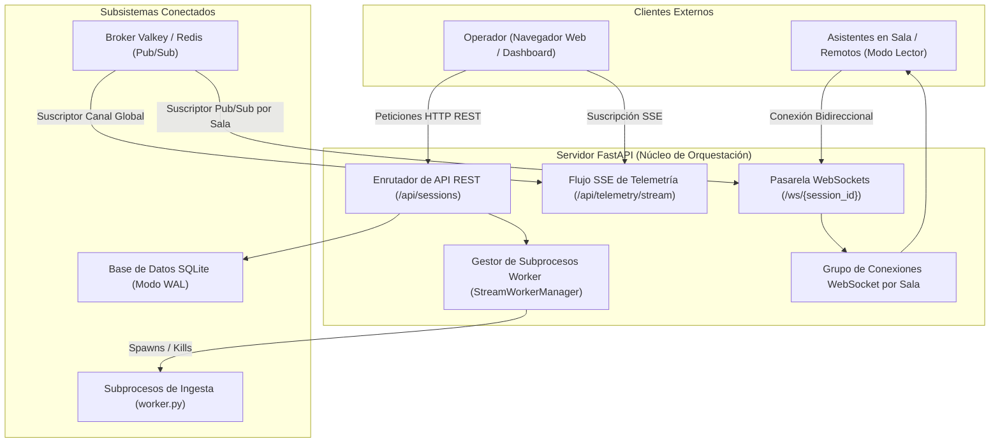
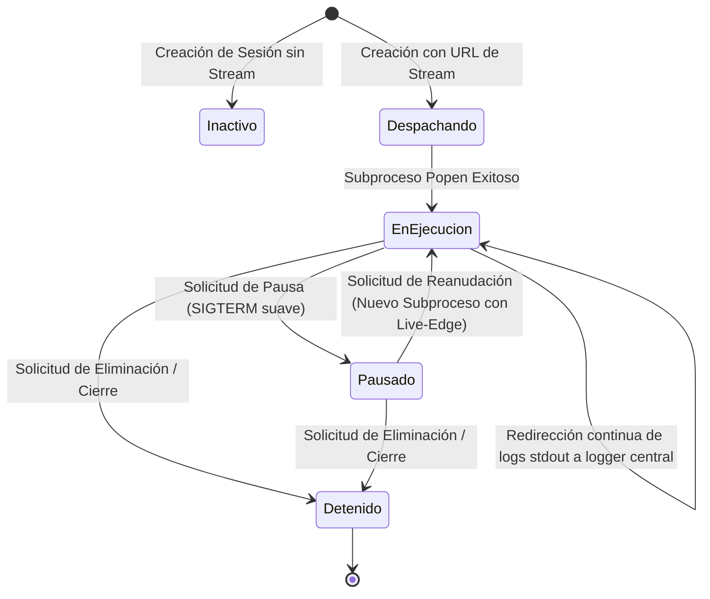
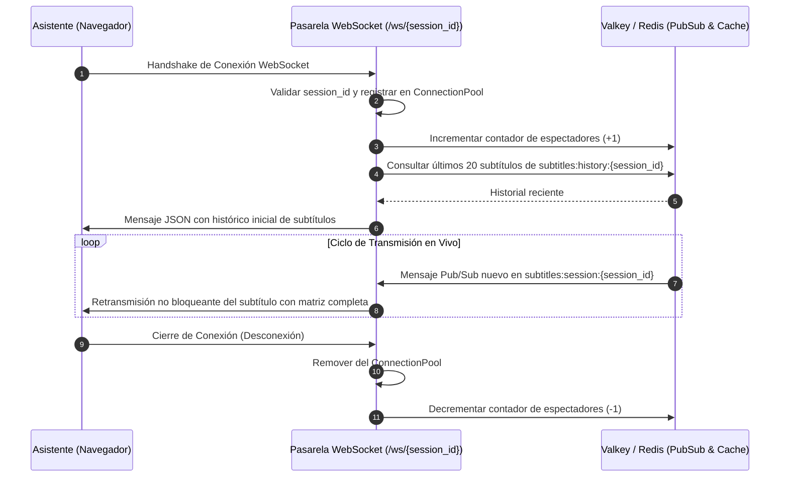

# Fase 5: Servidor de Orquestación, API REST y Transmisión en Tiempo Real

---

## 1. Objetivo de la Fase
Diseñar e implementar el servidor central de backend basado en **FastAPI** y **WebSockets**. Este componente actúa como el núcleo orquestador del sistema: administra el ciclo de vida de los subprocesos de ingesta de transmisiones, expone la API REST para la gestión de salas, provee un canal de eventos transmitidos por el servidor (**SSE**) para la telemetría en vivo del dashboard, y multiplexa la distribución de subtítulos mediante **WebSockets** aislados por sala hacia miles de clientes conectados simultáneamente.

---

## 2. Arquitectura del Servidor Central

---

## 3. Gestor de Subprocesos de Ingesta (StreamWorkerManager)

Cuando un operador agrega una transmisión online (YouTube, Twitch, Kick, RTMP o HLS), el servidor backend no debe procesar el audio en su propio ciclo de eventos asíncrono para no degradar la atención a los clientes WebSockets. En su lugar, despacha un subproceso worker dedicado y aislado.

### Especificación de Operación del Administrador:
1. **Aislamiento por Sala:** Mantiene un diccionario en memoria `workers[session_id]` que mapea cada identificador de sala con su descriptor de proceso del sistema operativo.
2. **Invocación Segura del Entorno:** Ejecuta `worker.py` utilizando de forma explícita el binario de Python del entorno virtual (`venv/bin/python`).
3. **Parámetros de Invocación por Línea de Comandos:**
   - `--session-id`: Identificador de sala normalizado en minúsculas y sin espacios.
   - `--source-lang`: Idioma de entrada del audio (`es`, `en`, `pt`).
   - `--target-lang`: Idioma sugerido.
   - `--stream-url`: URL remota de la transmisión multimedia.
   - `--is-live`: Bandera booleana activa si la fuente es un livestream (para forzar sintonización al presente).
4. **Reenvío de Logs en Tiempo Real:** Un hilo secundario dedicado (*log forwarder*) lee línea a línea la salida estándar (`stdout`) del subproceso y la reenvía al sistema de bitácora del servidor con el prefijo `[ROOM-STREAM]`.
5. **Detención Limpia:** Ante una pausa o cierre de sala, envía una señal de terminación suave (`SIGTERM`), espera hasta 3 segundos por su cierre voluntario, y si no finaliza, envía una señal forzada (`SIGKILL`) para garantizar la liberación de memoria.

---

## 4. Catálogo de Endpoints de la API REST

### 4.1. Listado y Estado de Sesiones: `GET /api/sessions`
- **Descripción:** Retorna la colección completa de salas activas, pausadas o cerradas con su snapshot telemétrico en tiempo real.
- **Respuesta (JSON):**
  - Lista de objetos con los campos: `session_id`, `title`, `status`, `source_lang`, `target_lang`, `stream_url`, `is_stream`, `created_at`, `viewers`, `duration_seconds`, `last_text_source`, `last_text_target`, y métricas consolidadas (`latency_ms`, `asr_ms`, `trans_ms`, `rpm`).

### 4.2. Creación de Nueva Sesión: `POST /api/sessions`
- **Descripción:** Registra una nueva sala y despacha el worker si se proporciona una URL de transmisión.
- **Estructura de la Petición (JSON):**
  - `session_id` (Obligatorio): Slug alfanumérico con guiones (ej. `"auditorio-a"`).
  - `title` (Opcional): Nombre descriptivo (ej. `"Auditorio Principal"`).
  - `source_lang` (Obligatorio): Idioma del audio de origen (`"es"`, `"en"`, o `"pt"`). **No se permite detección automática.**
  - `stream_url` (Opcional): URL válida de YouTube u otra plataforma compatible.
- **Regla de Negocio:** Si se incluye `stream_url`, el servidor detecta si la URL corresponde a una transmisión en vivo y arranca de inmediato el subproceso worker.

### 4.3. Pausar Transmisión: `POST /api/sessions/{session_id}/pause`
- **Descripción:** Suspende temporalmente la ingesta y emisión de subtítulos en la sala indicada.
- **Comportamiento:** Si existe un subproceso worker de stream activo para la sala, se detiene limpiamente. El estado en base de datos y memoria cambia a `"paused"`.

### 4.4. Reanudar Transmisión: `POST /api/sessions/{session_id}/resume`
- **Descripción:** Reactiva una sala previamente pausada.
- **Comportamiento:** Si la sala tenía configurada una URL de stream en vivo, se vuelve a despachar el subproceso worker configurado en modo *live-edge* para continuar desde el momento actual de la transmisión.

### 4.5. Eliminación de Sesión: `DELETE /api/sessions/{session_id}`
- **Descripción:** Detiene permanentemente cualquier worker activo y marca la sala como `"closed"` en base de datos.

### 4.6. Exportación de Subtítulos: `GET /api/sessions/{session_id}/export`
- **Parámetros de Consulta (Query Params):**
  - `format`: Formato de archivo solicitado (`srt`, `vtt`, o `txt`). Por defecto: `srt`.
  - `lang`: Idioma requerido para la exportación (`es`, `en`, `pt`, o `source`). Por defecto: `source`.
- **Cabeceras de Respuesta HTTP:**
  - `Content-Type`: `text/plain; charset=utf-8` o `application/x-subrip`.
  - `Content-Disposition`: `attachment; filename="{session_id}_{lang}.{ext}"`.

---

## 5. Canal de Telemetría en Vivo (Server-Sent Events - SSE)

Para abastecer las métricas e indicadores de estado del panel de control de forma continua y sin sobrecargar al servidor con sondeos continuos por polling:

- **Endpoint:** `GET /api/telemetry/stream`
- **Tipo de Contenido:** `text/event-stream`
- **Comportamiento del Emisor:**
  - Envía un evento cada 1.0 segundo con la telemetría agregada del sistema.
  - Incluye: número total de sesiones activas, espectadores globales, peticiones por minuto (RPM) agregadas, latencia promedio del sistema y estado de salud de cada sala.
  - Implementa señales periódicas de latido (*heartbeat*) para evitar que proxies inversos o balanceadores cierren la conexión por inactividad.

---

## 6. Pasarela WebSockets Multisesión en Tiempo Real

- **Endpoint:** `GET /ws/{session_id}`
- **Protocolo:** WebSocket nativo.

### Reglas de Operación de la Pasarela WebSocket:
1. **Aislamiento de Salas:** Cada mensaje recibido en el canal `subtitles:session:X` se retransmite únicamente a los clientes pertenecientes al grupo de conexiones de la sala `X`.
2. **Contextualización Inmediata:** Al conectarse, el cliente no tiene que esperar a que el orador vuelva a hablar; recibe de inmediato los últimos subtítulos emitidos desde la caché en memoria.
3. **No Bloqueo por Clientes Lentos (Backpressure):** Si un cliente con conexión inestable tiene el búfer de salida lleno, el mensaje se descarta para esa conexión particular para no retrasar a los demás clientes de la sala.

---

## 7. Criterios de Aceptación y Validación de la Fase 5

La IA que implemente esta fase debe validar los siguientes puntos:
- [ ] La API REST responde en formato JSON estándar y gestiona correctamente los códigos de estado HTTP (200, 201, 404, 422).
- [ ] El gestor de subprocesos arranca `worker.py` con los argumentos esperados al crear una sala con stream, y captura su salida en los logs generales.
- [ ] Las operaciones de pausa y reanudación detienen y relanzan los subprocesos de ingesta respetando el modo en vivo.
- [ ] El endpoint SSE emite paquetes `data: {...}\n\n` continuamente cada segundo sin fugas de conexiones.
- [ ] Clientes conectados a `/ws/{session_id}` reciben los subtítulos de su sala en menos de 20 ms desde que el worker los publica en Valkey.
- [ ] La exportación a SRT y WebVTT genera archivos descargables con cabeceras `Content-Disposition` válidas y timecodes precisos.
