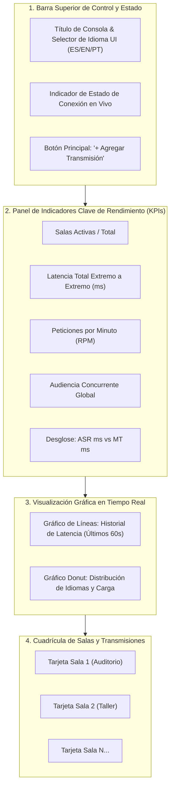
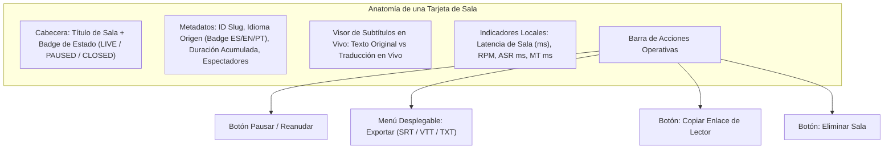
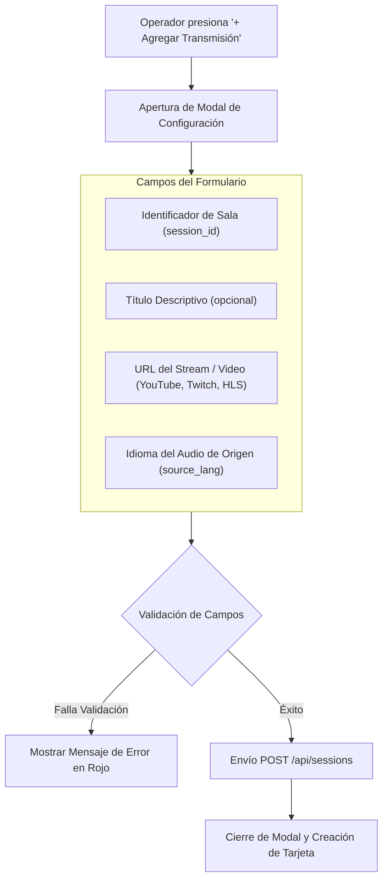
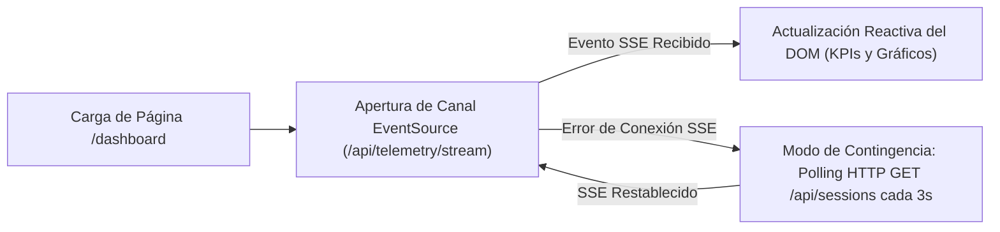

# Fase 6: Interfaz del Operador (Dashboard y Sala de Control)

---

## 1. Objetivo de la Fase
Diseñar e implementar la consola web de administración, observabilidad y control operativo en tiempo real para el equipo técnico del evento. Este panel permite monitorear de forma unificada la salud de todas las transmisiones activas, visualizar gráficos de latencia en vivo, auditar los subtítulos generados y gestionar el ciclo de vida de las salas (creación, pausa, reanudación, exportación y eliminación) sin requerir el reinicio de servidores ni la intervención en terminales de comandos.

---

## 2. Arquitectura Visual y Distribución del Dashboard

La consola está optimizada para monitores de cabina técnica (diseño oscuro de alto contraste y tipografía monoespaciada para métricas):

---

## 3. Especificación de Componentes e Indicadores

### 3.1. Tarjetas de Métricas Globales (KPIs)
| Indicador | Fuente de Datos | Código Semáforo Visual |
| :--- | :--- | :--- |
| **Salas Activas** | Conteo de salas en estado `active` sobre total de salas creadas. | Azul / Neutro |
| **Latencia Total Promedio** | Media móvil de `latency_ms` agregada de todas las salas. | **Verde:** < 1.500 ms **Amarillo:** 1.500 - 3.000 ms **Rojo:** > 3.000 ms |
| **Peticiones por Minuto (RPM)** | Suma de `rpm` de los workers activos en la ventana de 60 segundos. | Indicador cian de actividad |
| **Audiencia Global** | Sumatoria instantánea de clientes conectados vía WebSocket en todas las salas. | Púrpura |
| **Desglose ASR vs Traducción** | Tiempos promedio individuales de Whisper vs LLM. | Doble barra de proporción relativa |

---

## 4. Cuadrícula de Salas y Tarjetas de Transmisión

Cada sala creada se representa mediante una tarjeta interactiva independiente con la siguiente anatomía:

### Reglas de Visualización en la Tarjeta:
1. **Badge de Estado Dinámico:**
   - **`LIVE` (Verde con animación de pulso):** Transmisión ingiriendo audio y emitiendo subtítulos en tiempo real.
   - **`PAUSED` (Amarillo fijo):** Ingesta detenida temporalmente por el operador.
   - **`CLOSED` (Gris oscuro):** Transmisión finalizada permanentemente.
2. **Visor de Subtítulos Reactivo:** Muestra el último fragmento procesado con diferenciación visual clara entre el texto original hablado en la sala y su traducción.

---

## 5. Especificación del Modal "Agregar Transmisión"

El modal es la interfaz para dar de alta nuevas conferencias. Debe cumplir estrictamente con los siguientes requisitos de diseño funcional:

### Reglas Estrictas de los Campos del Modal:
1. **Identificador de Sala (`session_id`):** Campo de texto alfanumérico. La interfaz debe validar en tiempo real que solo contenga letras minúsculas, números y guiones medios (sin espacios ni caracteres especiales).
2. **URL de la Transmisión (`stream_url`):** Campo de texto con validación de formato URL para YouTube, Twitch o enlaces directos HLS (`.m3u8`).
3. **Selector de Idioma de Audio (Origen) (`source_lang`):**
   - **Opciones Disponibles Únicamente:**
     - `Español (ES)` *(Opción predeterminada)*
     - `English (EN)`
     - `Português (PT)`
   - **Regla Inviolable:** **NO debe existir la opción "Automático" o "Auto".** Fijar explícitamente el idioma evita que Whisper gaste ciclos intentando adivinar el idioma de los primeros segundos y previene que el audio empiece transcrito en una lengua errónea.
4. **Exclusión Absoluta del Selector de Idioma Destino:**
   - **Por qué NO se incluye:** El idioma de destino no es una propiedad estática de la sala. Cada usuario o asistente que ingresa a ver la conferencia elige de forma dinámica en su propia pantalla el idioma en que desea leer. La sala genera la matriz multilingüe completa (`es`, `en`, `pt`) en paralelo para satisfacer a todos los espectadores simultáneamente.

---

## 6. Lógica de Red y Sincronización en el Cliente

Para mantener el dashboard actualizado sin recargar la página ni congelar la interfaz:

### Retroalimentación al Operador (Toast System):
- Cualquier acción ejecutada por el operador (pausar sala, reanudar, copiar enlace o exportar archivo) debe mostrar una notificación flotante momentánea (*Toast*) con confirmación visual de éxito o detalle del error en caso de fallo HTTP.

---

## 7. Criterios de Aceptación y Validación de la Fase 6

La IA que implemente esta fase debe validar los siguientes puntos:
- [ ] El dashboard consume el flujo SSE de telemetría y actualiza los indicadores numéricos y gráficos sin recargar la página.
- [ ] El modal de agregar transmisión incluye exclusivamente el selector de idioma de origen (sin opción "auto") y no incluye selector de idioma destino.
- [ ] Las acciones de pausar y reanudar envían las peticiones REST correspondientes y actualizan de inmediato el estado visual de la tarjeta de sala.
- [ ] El botón de exportación permite descargar directamente los archivos en formato SRT, WebVTT o TXT en el navegador del operador.
- [ ] Al copiar el enlace del modo lector, se copia en el portapapeles la URL absoluta lista para ser enviada a los asistentes.
