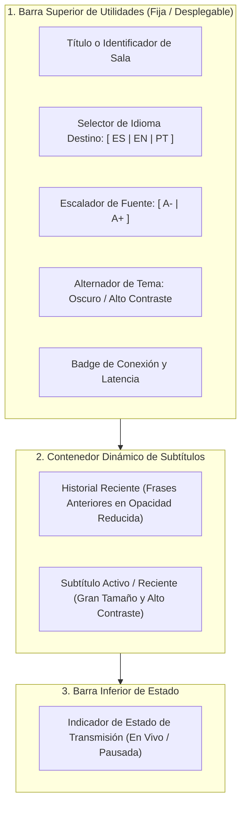
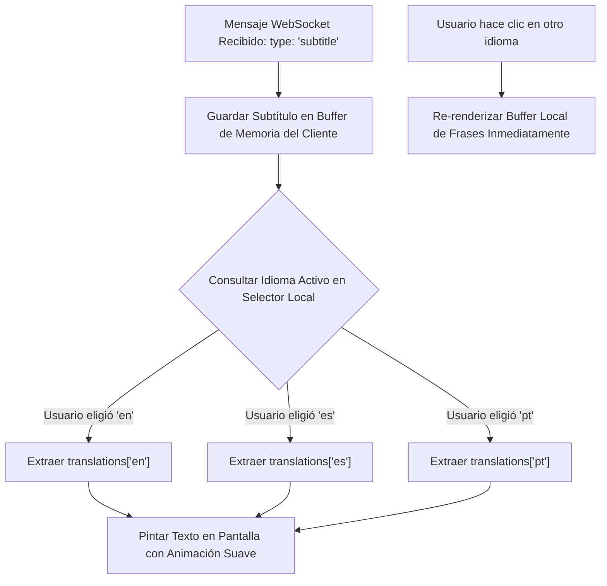
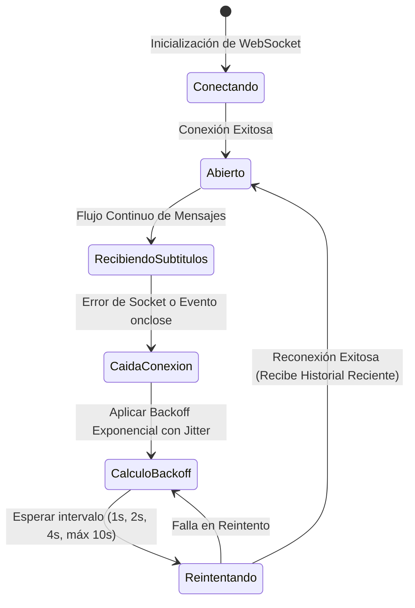

# Fase 7: Interfaz del Asistente (Modo Lector Multilingüe)

---

## 1. Objetivo de la Fase
Diseñar e implementar la interfaz de usuario orientada a los asistentes de la conferencia (tanto presenciales que leen desde sus teléfonos móviles como remotos que siguen la transmisión en sus computadoras o pantallas secundarias de auditorio). Este componente debe ser ultra liviano, accesible, de nula distracción cognitiva y con un tiempo de carga instantáneo. Su función primordial es recibir los subtítulos vía **WebSocket** en tiempo real y permitir que cada asistente seleccione individualmente el idioma en el que desea leer (**Español, Inglés o Portugués**) con cambio instantáneo en el navegador.

---

## 2. Arquitectura Visual y Distribución del Modo Lector



---

## 3. Especificación de Componentes de la Interfaz

### 3.1. Barra de Herramientas del Asistente
- **Selector Dinámico de Idioma Destino:**
  - Botones de selección rápida (*Pills*) para `ES`, `EN` y `PT`.
  - El idioma activo queda visualmente resaltado con un borde luminoso o color distintivo.
  - La preferencia seleccionada se guarda en el almacenamiento local del navegador (`localStorage`) para recordarla si el asistente recarga la página.
- **Escalador de Tamaño de Tipografía:**
  - Permite alternar entre 4 niveles de escala tipográfica:
    - *Móvil Compacto* (18px)
    - *Lectura Normal* (24px - Predeterminado)
    - *Accesibilidad / Grande* (32px)
    - *Modo Proyector / Auditorio* (48px - 64px)
- **Tema Visual Oscuro Predeterminado:**
  - Fondo negro absoluto (`#000000` o `#0a0a0f`) para ahorrar batería en pantallas OLED de móviles y no encandilar en salas de conferencia a oscuras.
  - Tipografía en blanco puro o ámbar suave de alto contraste y legibilidad.
- **Badge de Estado de Conexión:**
  - **Verde:** Conectado al WebSocket recibiendo subtítulos en vivo.
  - **Amarillo (Parpadeante):** Reconectando tras pérdida temporal de cobertura WiFi.
  - **Rojo:** Desconectado o sala cerrada.

---

## 4. Motor de Consumo Multilingüe y Cambio de Idioma en Cliente

El cliente WebSocket recibe de la Fase 5 un evento unificado con la matriz de traducciones generada por el pipeline de IA:



### Regla Crucial de Diseño de Red:
- **Cero Peticiones al Servidor al Cambiar de Idioma:**
  - Cuando un asistente pulsa el botón para cambiar de Español a Inglés, **NO se renegocia la conexión WebSocket, NO se consulta ninguna API REST y NO se recarga la página**.
  - El cambio es puramente en memoria del navegador: la interfaz simplemente pasa a leer la clave correspondiente del objeto `translations` que ya viene incluido en cada paquete recibido.
  - Incluso las últimas frases visibles en el historial cambian de idioma instantáneamente en pantalla.

---

## 5. Algoritmo de Resiliencia y Reconexión WebSocket

Dado que en conferencias presenciales masivas las redes WiFi suelen sufrir micro-cortes continuos por saturación de puntos de acceso:



### Reglas del Algoritmo de Reconexión:
1. **Backoff Exponencial:**
   - Intervalo base inicial: 1.0 segundo.
   - Progresión de duplicación: $1s \rightarrow 2s \rightarrow 4s \rightarrow 8s$ (Tope máximo: 10 segundos).
2. **Variación Aleatoria (*Jitter*):**
   - A cada intervalo se le suma o resta un valor aleatorio de entre $\pm 20\%$.
   - **Propósito:** Evita el problema de la "estampida de clientes" (*thundering herd*), donde cientos de teléfonos móviles intentan reconectarse en el mismo milisegundo exacto tras el reinicio de un router del evento.
3. **Recuperación Automática de Contexto:**
   - Al reconectar exitosamente, el servidor envía de inmediato la lista de los últimos 20 subtítulos almacenados en la memoria rápida, permitiendo que el asistente no se pierda nada de lo hablado durante su desconexión.

---

## 6. Algoritmo de Pintado y Desplazamiento Suave (Auto-Scroll)

Para que la lectura sea fluida y no canse la vista del lector:

```mermaid
flowchart TD
    SUB_IN["Nuevo Subtítulo para Renderizar"] --> CHECK_SCROLL{"¿El usuario ha scrolleado hacia arriba manualmente?"}
    
    CHECK_SCROLL -->|NO (Está al pie)| AUTO["Insertar Frase + Desplazamiento Suave (Smooth Auto-Scroll)"]
    CHECK_SCROLL -->|SÍ (Leyendo historial previo)| NO_AUTO["Insertar Frase en Silencio sin Mover la Pantalla"]
    NO_AUTO --> SHOW_BADGE["Mostrar Indicador Flotante: '↓ Nuevos subtítulos'"]
    
    SHOW_BADGE --> CLICK_DOWN["Usuario hace clic en el indicador"]
    CLICK_DOWN --> AUTO
```

### Reglas de Presentación Visual:
- **Puntuación y Capitalización:** Los fragmentos se presentan con su puntuación natural final (puntos, comas) resultante del motor de IA para facilitar la cadencia de lectura.
- **Poda del DOM:** Para evitar que la página web se vuelva lenta tras 8 horas de conferencia continua, el contenedor conserva en el árbol DOM únicamente los últimos 50 subtítulos, eliminando del inicio los más antiguos.

---

## 7. Criterios de Aceptación y Validación de la Fase 7

La IA que implemente esta fase debe validar los siguientes puntos:
- [ ] La interfaz del lector carga en menos de 500 ms y se adapta responsivamente a dispositivos móviles en orientación vertical y horizontal.
- [ ] La conexión WebSocket hacia `/ws/{session_id}` se establece limpiamente y recibe tanto el histórico inicial como los subtítulos en vivo.
- [ ] El cambio entre los idiomas Español, Inglés y Portugués ocurre de forma instantánea en el navegador sin recargar la página ni reenviar solicitudes de red.
- [ ] El escalador tipográfico modifica el tamaño del texto en pantalla de forma legible y persistente en el dispositivo del usuario.
- [ ] Ante una desconexión simulada de red, el cliente muestra el indicador de reconexión y se reconecta automáticamente aplicando backoff exponencial con jitter.
- [ ] Si la sala es pausada por el operador, la interfaz muestra el aviso correspondiente sin congelar la aplicación.
